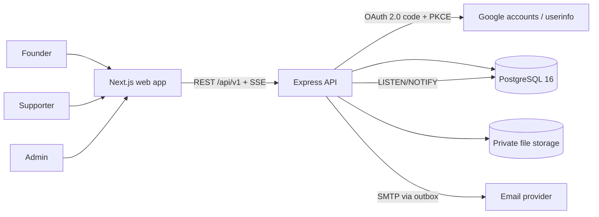

# InvestFund architecture

Status: **Current (v2, ADR 0002/0003).** Modular monolith: one Express API, one Next.js web app,
shared contracts and domain rules.

## System context



## Monorepo

```
apps/web            Next.js App Router, Tailwind tokens, Radix primitives, next-intl, TanStack Query
apps/api            Express API; src/core = infrastructure, src/modules = domain
packages/shared     Zod contracts (src/api), domain rules + state machines (src/domain), OpenAPI
packages/test-utils isolated per-suite PostgreSQL databases
infra/              docker-compose, mock-google (OAuth test IdP), synthetic seed
```

## Backend modules (`apps/api/src/modules`)

| Module | Responsibility |
|---|---|
| `auth` | Google OAuth (adapter `IdentityProvider`), state cookie, refresh sessions with rotation/reuse detection |
| `users` | `/me`, role choice, founder/supporter profiles, unread counts |
| `startups` | Draft/publish/archive, milestones, funding rules, saved startups |
| `discovery` | Search/filter/sort, public detail, relationship, **matching** (pure scoring + ranking) |
| `connections` | Request/accept/decline/withdraw state machine; creates the conversation on accept |
| `conversations` | Messages (idempotent), read state, derived unread counts |
| `realtime` | `RealtimeBus` (Postgres / memory) + SSE `RealtimeHub` |
| `deals` | Offers, counteroffers, revisions, outcome lifecycle, expiry sweep |
| `notifications` / `email` | In-app notifications + outbox, `EmailSender` adapter, dispatcher, templates |
| `documents` | Upload validation, private storage, per-request access checks, grants |
| `moderation` / `admin` | Blocks, reports, report review, suspension, overview |
| `shared` | Policies (blocks), audit trail, cursors, serialisation |

Layering: route (validation, guards, thin) → service (rules, transactions, authorisation) →
Prisma. Repositories are not added where Prisma queries are already the clearest boundary.
Patterns used where they earn their keep: **Adapter** (identity provider, realtime bus, email
sender, storage), **State machine tables** (connections, offers, deals), **Strategy-like factor
table** (matching), **Unit of Work** (transactions), **Transactional outbox** (email),
**Dependency injection** via the composition root (`core/container.ts`).

### Key flows
- **Sign-in:** `/auth/google/start` (state + PKCE in a signed cookie) → Google →
  `/auth/google/callback` (code exchange, userinfo, upsert) → refresh cookie → web
  `/auth/complete` → `POST /auth/refresh` → in-memory access token.
- **Accept connection:** lock-free conditional update `pending → accepted` + conversation insert
  in one transaction; partial unique indexes prevent duplicates.
- **Message:** persist (idempotent on `clientMessageId`) → notification (first unread only) →
  commit → `pg_notify` → every instance's hub → recipient SSE streams.
- **Offer response:** `SELECT … FOR UPDATE` on the deal → state-machine check → conditional
  updates + `version` bump → new immutable revision if countering → events, audit,
  notifications → commit → publish.
- **Email:** outbox row in the domain transaction → dispatcher leases with `SKIP LOCKED` →
  SMTP → `sent`/retry/`failed`.

### Security model
- Access JWT (HS256, 15 min, in memory) + refresh token (opaque, SHA-256 at rest, rotating,
  reuse detection, httpOnly, SameSite=Lax, path-scoped). Role/status re-read per request.
- Server-side authorisation in every service; IDOR policy returns 404 for invisible resources.
- Strict Zod schemas (no mass assignment), CHECK/UNIQUE constraints, transactions, row locks.
- Helmet, CORS allowlist, CSRF defence on cookie endpoints, rate-limit presets, upload
  sniffing, attachment downloads with sandbox CSP, audit trail, no PII/message text in logs.

## Frontend (`apps/web`)
- Route groups under `[locale]`: `(marketing)` public pages and discovery, `(auth)` sign-in and
  onboarding, `(app)` the authenticated shell (role-aware navigation), `admin`.
- Public pages render on the server from public endpoints; private pages are client components
  using TanStack Query with the in-memory access token. The API remains the only authority.
- Real time: one `fetch`-based SSE stream per tab; events invalidate queries and update unread
  badges; reconnect with backoff.
- All copy in `messages/en-GB.json`; amounts via `formatMoney`; dates via `Intl` in the user's
  timezone.

## Environments
| Env | Purpose |
|---|---|
| local | `pnpm dev` + Postgres (+ Mailpit, mock-google) |
| CI | lint, typecheck, unit + integration (service Postgres), build, audit |
| production | See `OPERATIONS.md` (managed Postgres + a container host that supports long-lived HTTP) |
