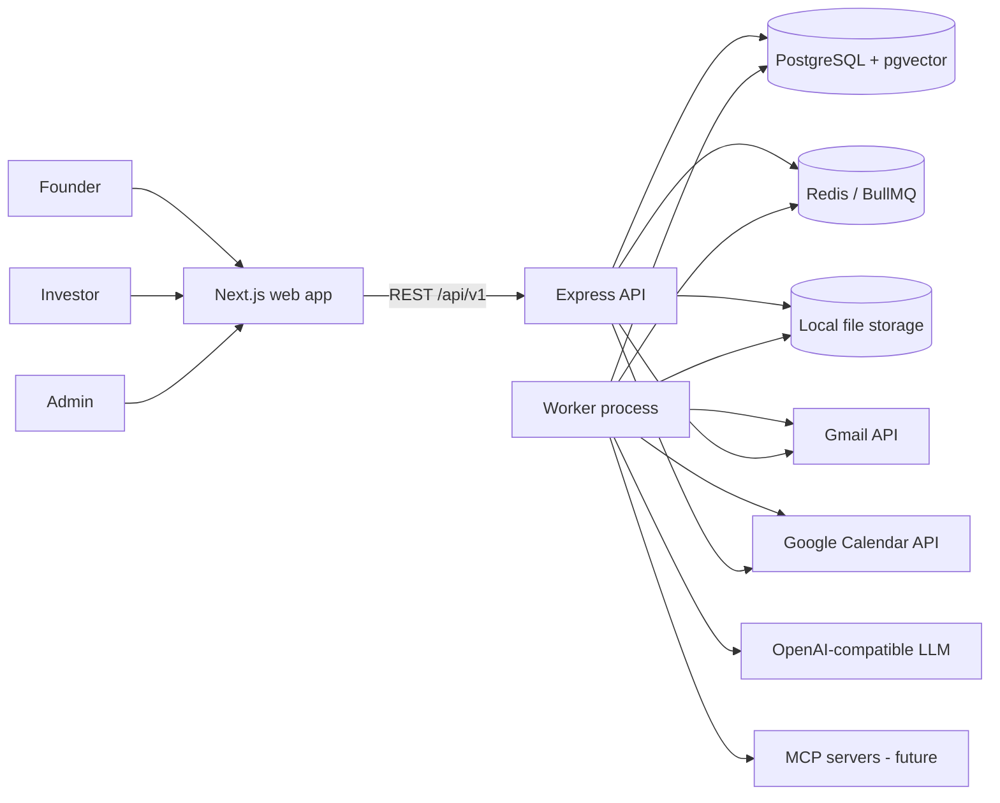

# InvestFund architecture

Status: **Draft v0.1**. The supervisor refines this in the planning step.

## System context



## Monorepo

```
apps/web           Next.js App Router, TypeScript, Tailwind, shadcn/ui, next-intl
apps/api           Express HTTP server + BullMQ worker entry (same codebase, two entrypoints)
packages/shared    Zod schemas (API contracts), enums, DTO types, OpenAPI generator
packages/test-utils factories, test helpers (later)
infra/             docker-compose, mocks (llm, google), seed, perf, sim
```

## Backend: modular monolith

Modules: `auth`, `users`, `startups`, `investors`, `documents`, `matching`, `analysis`, `campaigns`, `outreach`, `meetings`, `messaging`, `notifications`, `admin`, `jobs`.
Each module is layered: routes → controller → service → repository (see skill `express-module`).
Cross-cutting concerns live in `core/` (config, DI, errors, auth, logging, rate limiting, crypto, storage).
Integrations live in `integrations/` (llm, google, mcp) behind interfaces.

### Key flows

**Document extraction:** upload → stored on disk → `Document` row → `202` + job → the worker parses the file and runs the LLM extraction → `DocumentExtraction(pending_review)` → the founder accepts → the profile is updated → the embedding is refreshed.

**Matching:** when a profile is published or the thesis changes, the worker computes embeddings → a scheduled or on-demand `MatchRun` → hard filters (SQL) → vector similarity (pgvector) → a weighted score (Strategy per criterion) → LLM rationale for the top N → `Match` rows (one per startup–investor pair, with score breakdown and status).

**Double opt-in:** `POST /matches/{id}/interest` → notify the counterpart → `POST /matches/{id}/accept` → status `connected` → unlock policy applies.

**Approved outreach (Command pattern):** the AI creates an `EmailDraft` → the user edits it → `POST /outreach/drafts/{id}/approve` creates an `ApprovalRecord(payloadHash)` → the `SendEmailCommand` is queued → the worker verifies the hash and sends through Gmail → the thread is tracked.

**Meetings:** free/busy → `MeetingProposal` draft → approve → Calendar `events.insert` → notifications.

### Security model
- JWT access token (15 min) in memory, plus a rotating refresh token in an httpOnly Secure SameSite=Lax cookie
- RBAC (founder / investor / admin) plus ownership and membership guards, and a visibility policy service for startup data
- Secrets are encrypted with AES-256-GCM using a key from env (`ENCRYPTION_KEY`, versioned)
- Helmet, CORS allowlist, rate limits, upload MIME sniffing and size limits, and an antivirus hook (later)

## Frontend
- Route groups `(marketing)`, `(auth)`, `(app)` under `[locale]`
- Data through TanStack Query plus the typed client. Forms use RHF and the shared Zod schemas.
- Theming with next-themes (dark default) and CSS-variable tokens

## Environments
| Env | Purpose |
|---|---|
| local | Docker Compose infra + `pnpm dev` |
| sandbox | Full stack in Compose with mock LLM and Google, no egress; used for E2E and simulations |
| CI | GitHub Actions: lint, typecheck, unit, integration (service containers), E2E (sandbox) |
| production | TBD (an ADR is needed before launch) |
