# InvestFund logical data model

Status: **Draft v0.1, awaiting human approval (Gate A)** · Owner: Supervisor · Implemented by: Backend (Prisma, `apps/api/prisma/schema.prisma`)
Database: PostgreSQL 16 with the `vector` (pgvector) and `citext` extensions.
Related: [`PHASE_PLAN.md`](PHASE_PLAN.md) · [`API.md`](API.md)

---

## 1. Conventions

| Topic | Rule |
|---|---|
| Naming | Tables `snake_case` plural (Prisma `@@map`), models PascalCase, columns `snake_case` (`@map`). |
| Standard columns | Every table has `id uuid PK` (UUID v7, generated in the app, decision D5), `created_at timestamptz NOT NULL DEFAULT now()` and `updated_at timestamptz NOT NULL` (Prisma `@updatedAt`). **Append-only tables have no `updated_at`.** These columns are not repeated in the tables below. Exception: `platform_settings` uses `key` as its PK. |
| Soft delete | `deleted_at timestamptz NULL` only where audit or deletion workflows need it (marked per table). Default queries filter `deleted_at IS NULL`. |
| Money | `<name>_minor BIGINT` plus `currency CHAR(3) NOT NULL DEFAULT 'GBP'`. Never floats. API exposes `{ amountMinor: string, currency }`. LLM cost is the one non-GBP money value (`USD` by default, because providers price in USD). |
| Percentages | `NUMERIC(5,2)` (0.00–100.00, or ±999.99 for growth rates) with CHECK constraints. |
| Time | `timestamptz` (UTC). Calendar dates `date`. User time zone stored as an IANA name. |
| Text limits | `varchar(n)` where a limit is a business rule; `text` otherwise, with limits enforced by Zod. |
| Emails | `citext` (case-insensitive unique). |
| Flexible data | `jsonb` with a `schema_version` key inside the document (or a sibling column), validated by a Zod schema in `packages/shared`. |
| Secrets | `bytea` ciphertext (AES-256-GCM: `iv ‖ ciphertext ‖ tag`) plus `*_key_version smallint`. Never selected by default (explicit `select`). |
| Hashes | Lookup tokens are stored only as `sha256` hex (`char(64)`); raw tokens are never stored. IP addresses are stored as a keyed hash (`ip_hash`). |
| Enums | PostgreSQL enums through Prisma (§3). Adding a value is additive; removing one is destructive (Gate X). |
| PII classes | **none**, **personal** (identifies a person), **sensitive** (secrets, credentials, financial-status declarations, private message content). Startup commercial data is also marked **confidential (tiered)** because PRD §7 restricts it. |

## 2. Entity-relationship diagram

```mermaid
erDiagram
  users ||--o{ refresh_tokens : has
  users ||--o{ auth_tokens : has
  users ||--o{ oauth_accounts : links
  users ||--o{ consent_records : gives
  users ||--o{ audit_logs : acts
  users ||--o{ job_runs : owns
  users ||--o{ stored_files : uploads

  users ||--o| startup_members : "member of"
  startups ||--|{ startup_members : has
  startups ||--o{ startup_team_members : lists
  startups ||--o| startup_products : has
  startups ||--o| startup_traction : has
  startups ||--o{ traction_metrics : has
  startups ||--o{ funding_rounds : raises
  funding_rounds ||--o{ use_of_funds_items : allocates
  startups ||--o{ documents : owns
  stored_files ||--o| documents : stores
  documents ||--o{ document_extractions : yields
  startups ||--o{ invitations : invites
  investor_profiles ||--o{ invitations : invites

  users ||--o| investor_members : "member of"
  investor_profiles ||--|{ investor_members : has
  investor_profiles ||--o{ investor_team_members : lists
  investor_profiles ||--o| investment_theses : has
  investor_profiles ||--o{ portfolio_companies : holds
  users ||--o{ investor_certifications : signs

  startups ||--o{ startup_embeddings : embeds
  investor_profiles ||--o{ investor_embeddings : embeds
  matching_weights ||--o{ match_runs : uses
  match_runs ||--o{ matches : produces
  startups ||--o{ matches : "matched in"
  investor_profiles ||--o{ matches : "matched in"
  matches ||--o{ match_events : logs

  startups ||--o{ startup_analyses : analysed
  documents ||--o{ deck_reviews : reviewed

  startups ||--o{ campaigns : runs
  funding_rounds ||--o{ campaigns : for
  campaigns ||--o{ campaign_targets : targets
  matches ||--o{ campaign_targets : "based on"
  campaign_targets ||--o{ email_drafts : drafts
  campaign_targets ||--o{ email_threads : threads
  email_threads ||--o{ email_messages : contains
  users ||--o{ approval_records : approves
  approval_records ||--o| email_messages : authorises

  matches ||--o{ meeting_proposals : proposes
  meeting_proposals ||--o| meetings : books
  approval_records ||--o| meetings : authorises

  matches ||--o| conversations : opens
  conversations ||--o{ messages : contains
  messages ||--o{ message_attachments : has
  stored_files ||--o{ message_attachments : stores
  conversations ||--o{ conversation_reads : tracks

  users ||--o{ notifications : receives
  users ||--o{ notification_preferences : sets
  users ||--o{ content_flags : reports
  users ||--o{ data_requests : requests
  users ||--o{ assistant_threads : chats
  assistant_threads ||--o{ assistant_messages : contains
  llm_settings ||--o{ llm_usage : "priced by"
```

`platform_settings` has no relations. `job_runs` is referenced by most asynchronous tables (`job_id`), which the diagram omits for readability.

## 3. Enums

| Enum | Values |
|---|---|
| `UserRole` | `founder`, `investor`, `admin` |
| `UserStatus` | `pending_verification`, `active`, `suspended`, `deleted` |
| `AuthTokenType` | `email_verification`, `password_reset`, `google_signup_ticket` |
| `OAuthProvider` | `google` |
| `IntegrationStatus` | `connected`, `revoked`, `error` |
| `ConsentKind` | `terms`, `privacy_policy`, `marketing_email`, `analytics_cookies` |
| `ConsentSource` | `signup`, `settings`, `cookie_banner` |
| `MemberRole` | `owner`, `member` |
| `InvitationStatus` | `pending`, `accepted`, `revoked`, `expired` |
| `StartupStatus` | `draft`, `published`, `unpublished`, `suspended` |
| `BusinessModel` | `b2b`, `b2c`, `b2b2c`, `marketplace`, `saas`, `other` |
| `CompanyStage` | `idea`, `pre_seed`, `seed`, `series_a`, `series_b_plus` *(PRD does not define it: Assumption, pending human confirmation)* |
| `ProductStatus` | `idea`, `prototype`, `mvp`, `launched`, `scaling` |
| `SeisEisStatus` | `none`, `seis`, `eis`, `both`, `advance_assurance` |
| `FundingRoundType` | `pre_seed`, `seed`, `series_a`, `series_b_plus`, `bridge` |
| `FundingRoundStatus` | `planned`, `open`, `closed`, `cancelled` |
| `InstrumentType` | `equity`, `safe`, `asa`, `convertible_note`, `other` |
| `UseOfFundsCategory` | `product_development`, `hiring`, `marketing`, `sales`, `geographic_expansion`, `infrastructure`, `r_and_d`, `working_capital`, `other` |
| `DocumentKind` | `pitch_deck`, `business_plan`, `product_docs`, `financial_model`, `market_research`, `technical_docs`, `screenshot`, `other` |
| `DocumentStatus` | `uploaded`, `processing`, `ready`, `failed` |
| `ExtractionStatus` | `queued`, `running`, `pending_review`, `applied`, `partially_applied`, `discarded`, `failed` |
| `InvestorType` | `angel`, `vc_fund`, `family_office`, `cvc`, `syndicate`, `accelerator` |
| `InvestorProfileStatus` | `draft`, `active`, `paused`, `suspended` |
| `VerificationStatus` | `unsubmitted`, `pending`, `info_requested`, `verified`, `rejected` |
| `DeploymentStatus` | `actively_investing`, `selective`, `paused` |
| `LeadPreference` | `lead`, `follow`, `either` |
| `SeisEisPreference` | `required`, `preferred`, `no_preference` |
| `CertificationKind` | `certified_high_net_worth`, `certified_sophisticated`, `self_certified_sophisticated`, `investment_professional` *(wording and categories need UK legal review)* |
| `CertificationStatus` | `active`, `expired`, `revoked` |
| `MatchStatus` | `suggested`, `founder_interested`, `investor_interested`, `connected`, `declined`, `archived` |
| `MatchSide` | `founder`, `investor`, `system` |
| `MatchEventType` | `generated`, `rescored`, `interest_expressed`, `interest_withdrawn`, `accepted`, `declined`, `archived` |
| `MatchRunScope` | `startup`, `investor`, `full` |
| `MatchRunTrigger` | `profile_published`, `thesis_updated`, `scheduled`, `manual`, `weights_changed` |
| `JobType` | `document_extraction`, `embedding_refresh`, `match_run`, `match_rationale`, `startup_analysis`, `deck_review`, `outreach_draft`, `email_send`, `gmail_sync`, `meeting_proposal`, `calendar_event`, `notification_email`, `certification_reminder`, `data_export`, `account_deletion`, `assistant_turn`, `retention_sweep` |
| `JobStatus` | `queued`, `running`, `succeeded`, `failed`, `cancelled` |
| `CampaignStatus` | `active`, `paused`, `archived` |
| `PipelineStage` | `matched`, `interested`, `connected`, `contacted`, `replied`, `meeting`, `due_diligence`, `committed`, `passed` |
| `DraftKind` | `initial`, `follow_up` |
| `DraftOrigin` | `ai`, `manual` |
| `DraftStatus` | `generating`, `draft`, `approved`, `sending`, `sent`, `failed`, `discarded` |
| `ApprovalAction` | `send_email`, `create_calendar_event`, `cancel_calendar_event` |
| `ApprovalStatus` | `approved`, `consumed`, `invalidated`, `expired`, `failed` |
| `EmailDirection` | `outbound`, `inbound` |
| `ReplyClassification` | `interested`, `needs_info`, `not_now`, `declined`, `out_of_office`, `unclassified` |
| `MeetingProposalStatus` | `generating`, `draft`, `approved`, `booked`, `cancelled`, `failed` |
| `MeetingStatus` | `scheduled`, `cancelled`, `completed` |
| `NotificationType` | `new_match`, `interest_received`, `connection_accepted`, `reply_received`, `meeting_booked`, `ai_job_done`, `message_received`, `follow_up_due`, `investor_verification`, `certification_expiring`, `invitation` |
| `LlmTask` | `default`, `extraction`, `embedding`, `matching`, `analysis`, `drafting`, `classification`, `assistant` |
| `FlagTargetType` | `startup`, `investor_profile`, `message`, `document`, `user` |
| `FlagStatus` | `open`, `dismissed`, `actioned` |
| `DataRequestType` | `export`, `deletion` |
| `DataRequestStatus` | `requested`, `processing`, `completed`, `failed`, `cancelled` |
| `AssistantRole` | `user`, `assistant`, `tool` |

Audit `action` values are a namespaced `varchar(64)` (for example `auth.login_failed`, `startup.demo_credentials_revealed`) defined as a constant list in `packages/shared`, not a DB enum, so new actions need no migration.

## 4. Tables

54 tables, grouped by aggregate. "Phase" is the phase whose migration creates the table.

### 4.1 Identity and access

#### `users` (P1)
Platform accounts. One role per user (A6).

| Column | Type | Null | Default | Notes |
|---|---|---|---|---|
| email | citext | no | | Unique. Replaced with `deleted+<id>@invalid` on anonymisation. |
| email_verified_at | timestamptz | yes | | |
| password_hash | text | yes | | argon2id. Null for Google-only accounts. |
| role | UserRole | no | | Immutable after signup in the MVP. |
| status | UserStatus | no | `pending_verification` | |
| full_name | varchar(120) | no | | |
| locale | varchar(10) | no | `'en-GB'` | |
| timezone | varchar(64) | no | `'Europe/London'` | IANA name |
| working_hours | jsonb | yes | | `{ schemaVersion, days[], start, end }` for slot proposals (P7) |
| last_login_at | timestamptz | yes | | |
| failed_login_count | smallint | no | 0 | Progressive lockout |
| locked_until | timestamptz | yes | | |
| deleted_at | timestamptz | yes | | Soft delete + anonymisation (D11) |

Keys and indexes: `UNIQUE(email)`; `INDEX(role, status)` (admin user list); `INDEX(created_at)` (analytics).
PII: personal · Retention: while active; anonymised within 30 days of a deletion request.

#### `refresh_tokens` (P1)
Rotating refresh tokens grouped into families for reuse detection.

| Column | Type | Null | Default | Notes |
|---|---|---|---|---|
| user_id | uuid | no | | FK `users` ON DELETE CASCADE |
| family_id | uuid | no | | Shared by every rotation of one login |
| token_hash | char(64) | no | | SHA-256 of the opaque token |
| expires_at | timestamptz | no | | 30 days (absolute family limit 90 days) |
| revoked_at | timestamptz | yes | | |
| revoked_reason | varchar(32) | yes | | `rotated`, `logout`, `logout_all`, `reuse_detected`, `suspended`, `password_changed` |
| replaced_by_id | uuid | yes | | FK `refresh_tokens` ON DELETE SET NULL |
| user_agent | varchar(255) | yes | | |
| ip_hash | char(64) | yes | | |

Keys and indexes: `UNIQUE(token_hash)`; `INDEX(user_id)`; `INDEX(family_id)`; `INDEX(expires_at)` (purge).
PII: personal · Retention: deleted 30 days after expiry or revocation.

#### `auth_tokens` (P1)
Single-use tokens for email verification, password reset and the Google sign-up ticket.

| Column | Type | Null | Default | Notes |
|---|---|---|---|---|
| user_id | uuid | yes | | FK `users` ON DELETE CASCADE. Null for `google_signup_ticket` (user not created yet). |
| type | AuthTokenType | no | | |
| token_hash | char(64) | no | | |
| payload_enc | bytea | yes | | Encrypted Google profile for the sign-up ticket |
| payload_key_version | smallint | yes | | |
| expires_at | timestamptz | no | | 24 h verification, 1 h reset, 15 min ticket |
| used_at | timestamptz | yes | | |

Keys and indexes: `UNIQUE(token_hash)`; `INDEX(user_id, type)`; `INDEX(expires_at)`.
PII: personal · Retention: deleted 7 days after expiry or use.

#### `oauth_accounts` (P1, Gmail and Calendar columns used from P6/P7)
Google identity link plus incremental Gmail and Calendar grants.

| Column | Type | Null | Default | Notes |
|---|---|---|---|---|
| user_id | uuid | no | | FK `users` ON DELETE CASCADE |
| provider | OAuthProvider | no | `google` | |
| provider_user_id | varchar(255) | no | | Google `sub` |
| provider_email | citext | no | | |
| granted_scopes | text[] | no | `{}` | |
| access_token_enc | bytea | yes | | |
| access_token_expires_at | timestamptz | yes | | |
| refresh_token_enc | bytea | yes | | |
| token_key_version | smallint | yes | | |
| gmail_status | IntegrationStatus | yes | | Null = never connected |
| gmail_history_id | varchar(32) | yes | | Sync cursor for `history.list` |
| gmail_last_synced_at | timestamptz | yes | | |
| calendar_status | IntegrationStatus | yes | | |
| revoked_at | timestamptz | yes | | |

Keys and indexes: `UNIQUE(provider, provider_user_id)`; `UNIQUE(user_id, provider)`; `INDEX(gmail_status)` partial `WHERE gmail_status = 'connected'` (sync scheduler).
PII: **sensitive** (tokens) · Retention: tokens deleted and revoked at Google on disconnect or account deletion.

#### `consent_records` (P1, append-only)
Evidence of consent given or withdrawn.

| Column | Type | Null | Default | Notes |
|---|---|---|---|---|
| user_id | uuid | no | | FK `users` ON DELETE CASCADE (users are anonymised, not hard-deleted) |
| kind | ConsentKind | no | | |
| policy_version | varchar(20) | no | | Version of the terms or policy text |
| granted | boolean | no | | |
| source | ConsentSource | no | | |
| ip_hash | char(64) | yes | | |
| user_agent | varchar(255) | yes | | |

Indexes: `INDEX(user_id, kind, created_at DESC)` (current consent state).
PII: personal · Retention: 6 years after account closure *(Assumption, pending legal confirmation)*.

#### `audit_logs` (P1, append-only)
Security and compliance events. A trigger rejects `UPDATE` and `DELETE` (except by the retention job's role).

| Column | Type | Null | Default | Notes |
|---|---|---|---|---|
| actor_user_id | uuid | yes | | FK `users` ON DELETE SET NULL. Null = system. |
| actor_role | UserRole | yes | | Snapshot |
| action | varchar(64) | no | | Namespaced constant (§3) |
| subject_type | varchar(40) | yes | | e.g. `startup`, `match`, `llm_settings` |
| subject_id | uuid | yes | | |
| request_id | varchar(64) | yes | | |
| ip_hash | char(64) | yes | | |
| metadata | jsonb | no | `'{}'` | IDs and enums only. Never PII, secrets or document content. |

Indexes: `INDEX(subject_type, subject_id, created_at DESC)`; `INDEX(actor_user_id, created_at DESC)`; `INDEX(action, created_at DESC)`.
PII: personal (actor) · Retention: 2 years; entries about approvals and certifications 6 years *(Assumption, pending legal confirmation)*.

### 4.2 Files and jobs

#### `stored_files` (P2)
Metadata for every object held by the `StorageProvider`.

| Column | Type | Null | Default | Notes |
|---|---|---|---|---|
| storage_key | varchar(255) | no | | Opaque, generated path (never the user's filename) |
| original_name | varchar(255) | no | | Sanitised; shown to users only |
| mime_type | varchar(127) | no | | From content sniffing, not the client header |
| size_bytes | bigint | no | | CHECK `≤ 26214400` (25 MB) |
| sha256 | char(64) | no | | |
| uploaded_by | uuid | yes | | FK `users` ON DELETE SET NULL |
| deleted_at | timestamptz | yes | | The object is removed from disk by the retention job |

Keys and indexes: `UNIQUE(storage_key)`; `INDEX(uploaded_by)`.
PII: personal (filenames, content may contain personal data) · Retention: follows the owning row (document, attachment, export).

#### `rate_limit_buckets` (P0, infrastructure)
Fixed-window rate-limit counters for `core/rateLimit` (API.md §3). Postgres-backed in R0–R1 (human decision 2026-10-09); replaced by Redis in R2. One row per preset and subject, updated in place by an atomic `INSERT ... ON CONFLICT (preset, key_hash) DO UPDATE ... RETURNING`.

| Column | Type | Null | Default | Notes |
|---|---|---|---|---|
| preset | varchar(32) | no | | `auth`, `upload`, `ai`, `sensitive`, `default` (validated in code, not a DB enum: presets are configuration) |
| key_hash | char(64) | no | | HMAC-SHA-256 hex (`IP_HASH_SECRET`) of `ip:<addr>` or `user:<id>`; raw IPs are never stored |
| hits | integer | no | | Hits in the current window |
| window_ends_at | timestamptz | no | | Database time; the next hit after it restarts the window at 1 |

Keys and indexes: `UNIQUE(preset, key_hash)`; `INDEX(window_ends_at)` (cleanup).
PII: none (keyed hashes only) · Retention: rows past `window_ends_at` are deleted in batches of 1000 by `deleteExpired()`, run opportunistically every 1000 hits per API process.

#### `job_runs` (P2)
Durable record of each background job. Its `id` is also the BullMQ job ID. Backs `GET /jobs/{id}`.

| Column | Type | Null | Default | Notes |
|---|---|---|---|---|
| type | JobType | no | | |
| status | JobStatus | no | `queued` | |
| progress | smallint | no | 0 | 0–100 |
| owner_user_id | uuid | yes | | FK `users` ON DELETE SET NULL. Authorises job reads. |
| subject_type | varchar(40) | yes | | |
| subject_id | uuid | yes | | |
| idempotency_key | varchar(128) | yes | | From the `Idempotency-Key` header |
| attempts | smallint | no | 0 | |
| result | jsonb | yes | | Links to created resources only |
| error_code | varchar(64) | yes | | Sanitised; no provider payloads |
| started_at, finished_at | timestamptz | yes | | |

Keys and indexes: `UNIQUE(owner_user_id, type, idempotency_key)` (nullable key ignored); `INDEX(owner_user_id, created_at DESC)`; `INDEX(subject_type, subject_id)`; `INDEX(status, type)`.
PII: none · Retention: 90 days after `finished_at`.

### 4.3 Startup aggregate

#### `startups` (P2)
Company information (FR-STARTUP-01) and publication state (FR-STARTUP-09).

| Column | Type | Null | Default | Notes |
|---|---|---|---|---|
| name | varchar(120) | no | | Gated (PRD §7) |
| public_name_visible | boolean | no | false | Founder opts to show the name in teasers |
| one_liner | varchar(160) | yes | | Teaser one-line pitch; required to publish |
| description | text | yes | | |
| industry | varchar(64) | yes | | Taxonomy code (A9) |
| sub_industry | varchar(64) | yes | | |
| business_model | BusinessModel | yes | | |
| country | char(2) | no | `'GB'` | ISO 3166-1 |
| city | varchar(80) | yes | | |
| target_markets | text[] | no | `{}` | Region or country codes |
| website | varchar(2048) | yes | | Gated |
| company_stage | CompanyStage | yes | | |
| founded_on | date | yes | | |
| team_size | integer | yes | | CHECK `> 0` |
| companies_house_number | varchar(8) | yes | | CHECK `~ '^([0-9]{8}|[A-Z]{2}[0-9]{6})$'` |
| seis_eis_status | SeisEisStatus | no | `none` | Teaser field |
| status | StartupStatus | no | `draft` | |
| published_at | timestamptz | yes | | |
| completeness_score | smallint | no | 0 | 0–100, recomputed on write |
| traction_band | varchar(32) | yes | | Derived teaser band (for example `pre_revenue`, `mrr_0_10k`); definitions in `packages/shared` |
| logo_file_id | uuid | yes | | FK `stored_files` ON DELETE SET NULL |
| deleted_at | timestamptz | yes | | |

Indexes: `INDEX(status, published_at)` (matching candidates); `INDEX(industry)`; `GIN(target_markets)`.
PII: none; **confidential (tiered)** · Retention: while the owner account exists; soft-deleted rows are purged after 30 days.

#### `startup_members` (P2)
Platform users who can manage a startup.

| Column | Type | Null | Default | Notes |
|---|---|---|---|---|
| startup_id | uuid | no | | FK `startups` ON DELETE CASCADE |
| user_id | uuid | no | | FK `users` ON DELETE CASCADE |
| role | MemberRole | no | `member` | |

Keys and indexes: `UNIQUE(startup_id, user_id)`; `UNIQUE(user_id)` (A6); partial `UNIQUE(startup_id) WHERE role = 'owner'`.
PII: none · Retention: removed with the membership.

#### `startup_team_members` (P2)
Founding team as displayed (FR-STARTUP-02). Optionally linked to a platform user.

| Column | Type | Null | Default | Notes |
|---|---|---|---|---|
| startup_id | uuid | no | | FK `startups` ON DELETE CASCADE |
| user_id | uuid | yes | | FK `users` ON DELETE SET NULL |
| full_name | varchar(120) | no | | |
| role_title | varchar(80) | no | | |
| bio | text | yes | | |
| prior_startup_experience | text | yes | | |
| industry_experience | text | yes | | |
| linkedin_url | varchar(2048) | yes | | |
| expertise_tags | text[] | no | `{}` | |
| display_order | smallint | no | 0 | |

Indexes: `INDEX(startup_id, display_order)`.
PII: personal; gated · Retention: with the startup.

#### `startup_products` (P2)
Product, MVP and demo access (FR-STARTUP-03, FR-STARTUP-04). One row per startup.

| Column | Type | Null | Default | Notes |
|---|---|---|---|---|
| startup_id | uuid | no | | FK `startups` ON DELETE CASCADE, UNIQUE |
| description, problem, solution | text | yes | | |
| category | varchar(64) | yes | | |
| technologies | text[] | no | `{}` | |
| competitive_advantages | text | yes | | |
| intellectual_property | text | yes | | |
| product_status | ProductStatus | yes | | |
| mvp_description | text | yes | | |
| mvp_url, demo_url | varchar(2048) | yes | | |
| demo_credentials_enc | bytea | yes | | `{ username, password, notes }` encrypted |
| demo_credentials_key_version | smallint | yes | | |
| demo_credentials_updated_at | timestamptz | yes | | |

PII: **sensitive** (demo credentials); rest confidential (tiered) · Retention: with the startup; credentials deleted on request.

#### `startup_traction` (P2)
Headline traction figures (FR-STARTUP-04). One row per startup.

| Column | Type | Null | Default | Notes |
|---|---|---|---|---|
| startup_id | uuid | no | | FK `startups` ON DELETE CASCADE, UNIQUE |
| current_users | integer | yes | | CHECK `≥ 0` |
| paying_customers | integer | yes | | CHECK `≥ 0` |
| revenue_ttm_minor | bigint | yes | | Trailing-12-month revenue *(definition: Assumption, pending human confirmation)* |
| mrr_minor | bigint | yes | | |
| currency | char(3) | no | `'GBP'` | |
| growth_rate_pct | numeric(5,2) | yes | | Month-on-month, may be negative |
| retention_pct | numeric(5,2) | yes | | CHECK 0–100 |
| as_of | date | yes | | |

PII: none; confidential (tiered) · Retention: with the startup.

#### `traction_metrics` (P2)
Additional key/value metrics with a period (FR-STARTUP-04 "other metrics").

| Column | Type | Null | Default | Notes |
|---|---|---|---|---|
| startup_id | uuid | no | | FK `startups` ON DELETE CASCADE |
| key | varchar(64) | no | | |
| value | numeric(20,4) | no | | |
| unit | varchar(24) | yes | | |
| period_start, period_end | date | no | | CHECK `period_start ≤ period_end` |
| note | varchar(255) | yes | | |

Indexes: `INDEX(startup_id, key, period_end DESC)`.
PII: none; confidential (tiered) · Retention: with the startup.

#### `funding_rounds` (P2)
Fundraising requirement and timeline (FR-STARTUP-05, FR-STARTUP-07).

| Column | Type | Null | Default | Notes |
|---|---|---|---|---|
| startup_id | uuid | no | | FK `startups` ON DELETE CASCADE |
| round_type | FundingRoundType | no | | Teaser field |
| status | FundingRoundStatus | no | `planned` | |
| is_current | boolean | no | false | |
| amount_required_minor | bigint | no | | Teaser (round size) |
| currency | char(3) | no | `'GBP'` | |
| min_ticket_minor | bigint | yes | | |
| max_target_minor | bigint | yes | | |
| pre_money_valuation_minor | bigint | yes | | Gated |
| equity_offered_pct | numeric(5,2) | yes | | CHECK 0–100; gated |
| instrument | InstrumentType | no | | Teaser field |
| instrument_other | varchar(80) | yes | | Required when `instrument = 'other'` |
| start_date | date | yes | | |
| target_close_date | date | yes | | CHECK `≥ start_date` |
| committed_amount_minor | bigint | no | 0 | CHECK `≥ 0` |
| lead_investor_secured | boolean | no | false | |
| existing_investors | jsonb | no | `'[]'` | `[{ name, type, amountMinor? }]`, schema-versioned; gated |
| milestones | text | yes | | |

Checks: `min_ticket_minor ≤ amount_required_minor ≤ COALESCE(max_target_minor, amount_required_minor)`.
Keys and indexes: partial `UNIQUE(startup_id) WHERE is_current`; `INDEX(round_type, status)` (hard filters).
PII: personal (existing investor names); confidential (tiered) · Retention: with the startup.

#### `use_of_funds_items` (P2)
Line items for FR-STARTUP-06. Replaced as a set in one transaction; the service validates that allocations total 100.00% and amounts total the round target ±1%.

| Column | Type | Null | Default | Notes |
|---|---|---|---|---|
| funding_round_id | uuid | no | | FK `funding_rounds` ON DELETE CASCADE |
| category | UseOfFundsCategory | no | | |
| amount_minor | bigint | no | | CHECK `> 0` |
| allocation_pct | numeric(5,2) | no | | CHECK `> 0 AND ≤ 100` |
| description | text | yes | | |
| expected_outcome | text | yes | | |
| display_order | smallint | no | 0 | |

Indexes: `INDEX(funding_round_id, display_order)`.
PII: none; gated · Retention: with the round.

#### `invitations` (P2 for startups, P3 for investor profiles)
Email invitations to join a startup or an investor profile.

| Column | Type | Null | Default | Notes |
|---|---|---|---|---|
| email | citext | no | | |
| startup_id | uuid | yes | | FK `startups` ON DELETE CASCADE |
| investor_profile_id | uuid | yes | | FK `investor_profiles` ON DELETE CASCADE |
| role | MemberRole | no | `member` | |
| token_hash | char(64) | no | | |
| invited_by | uuid | yes | | FK `users` ON DELETE SET NULL |
| status | InvitationStatus | no | `pending` | |
| expires_at | timestamptz | no | | 7 days |
| accepted_by_user_id | uuid | yes | | FK `users` ON DELETE SET NULL |

Checks: exactly one of `startup_id`, `investor_profile_id` is non-null.
Keys and indexes: `UNIQUE(token_hash)`; `INDEX(email, status)`; partial `UNIQUE(startup_id, email) WHERE status = 'pending'` and the same for `investor_profile_id`.
PII: personal · Retention: deleted 90 days after acceptance, revocation or expiry.

#### `documents` (P2)
Uploaded supporting documents (FR-STARTUP-08), including screenshots.

| Column | Type | Null | Default | Notes |
|---|---|---|---|---|
| startup_id | uuid | no | | FK `startups` ON DELETE CASCADE |
| file_id | uuid | no | | FK `stored_files` ON DELETE RESTRICT, UNIQUE |
| kind | DocumentKind | no | | |
| title | varchar(200) | no | | |
| status | DocumentStatus | no | `uploaded` | |
| uploaded_by | uuid | yes | | FK `users` ON DELETE SET NULL |
| page_count | integer | yes | | |
| shared_with_connections | boolean | no | true | Founder can keep a file private even after connection |
| deleted_at | timestamptz | yes | | |

Indexes: `INDEX(startup_id, kind, created_at DESC)`.
Parsed text is a derived artefact cached through the `StorageProvider` (key `derived/<documentId>.txt`), not in the DB.
PII: personal (may contain personal data); confidential (tiered) · Retention: until deleted by the founder or account deletion; never used for model training (NFR-PRIV-01).

#### `document_extractions` (P2)
AI-extracted facts awaiting founder review (FR-AI-01).

| Column | Type | Null | Default | Notes |
|---|---|---|---|---|
| document_id | uuid | no | | FK `documents` ON DELETE CASCADE |
| job_id | uuid | yes | | FK `job_runs` ON DELETE SET NULL |
| status | ExtractionStatus | no | `queued` | |
| facts | jsonb | yes | | `StartupFacts` v1: `[{ path, value, confidence, source: { page, quote ≤ 200 chars } }]` |
| facts_schema_version | varchar(16) | no | | |
| prompt_id | varchar(64) | no | | |
| prompt_version | smallint | no | | |
| model | varchar(100) | yes | | |
| applied_paths | text[] | no | `{}` | Profile paths the founder accepted |
| reviewed_by | uuid | yes | | FK `users` ON DELETE SET NULL |
| reviewed_at | timestamptz | yes | | |
| error_code | varchar(64) | yes | | |

Indexes: `INDEX(document_id, created_at DESC)`; `INDEX(status)`.
PII: personal (quotes may contain names) · Retention: with the document.

### 4.4 Investor aggregate

#### `investor_profiles` (P3)
Investor identity and capacity (FR-INV-01, FR-INV-04) and verification state (FR-INV-02, FR-ADM-01).

| Column | Type | Null | Default | Notes |
|---|---|---|---|---|
| investor_type | InvestorType | no | | |
| display_name | varchar(120) | no | | |
| firm_name | varchar(160) | yes | | |
| bio | text | yes | | |
| linkedin_url, website | varchar(2048) | yes | | LinkedIn gated until connection (A10) |
| country | char(2) | no | `'GB'` | |
| city | varchar(80) | yes | | |
| contact_email | citext | yes | | Defaults to the owner's email; gated until connection |
| status | InvestorProfileStatus | no | `draft` | |
| verification_status | VerificationStatus | no | `unsubmitted` | |
| verification_submitted_at | timestamptz | yes | | |
| verified_at | timestamptz | yes | | |
| verified_by | uuid | yes | | FK `users` ON DELETE SET NULL |
| verification_note | text | yes | | Admin-internal; never returned to the investor |
| fund_size_minor | bigint | yes | | |
| annual_allocation_minor | bigint | yes | | |
| currency | char(3) | no | `'GBP'` | |
| investments_per_year | smallint | yes | | |
| deployment_status | DeploymentStatus | yes | | |
| typical_decision_days | smallint | yes | | |
| deleted_at | timestamptz | yes | | |

Indexes: `INDEX(verification_status, verification_submitted_at)` (admin queue); `INDEX(status, verification_status)` (matching candidates).
PII: personal (angels are individuals) · Retention: while the owner account exists; purged 30 days after soft delete.

#### `investor_members` (P3)
Platform users who act for an investor profile.

| Column | Type | Null | Default | Notes |
|---|---|---|---|---|
| investor_profile_id | uuid | no | | FK `investor_profiles` ON DELETE CASCADE |
| user_id | uuid | no | | FK `users` ON DELETE CASCADE |
| role | MemberRole | no | `member` | |
| position_title | varchar(80) | yes | | |

Keys and indexes: `UNIQUE(investor_profile_id, user_id)`; `UNIQUE(user_id)` (A6); partial `UNIQUE(investor_profile_id) WHERE role = 'owner'`.
PII: none · Retention: removed with the membership.

#### `investor_team_members` (P3)
Team as displayed on a firm profile.

| Column | Type | Null | Default | Notes |
|---|---|---|---|---|
| investor_profile_id | uuid | no | | FK `investor_profiles` ON DELETE CASCADE |
| user_id | uuid | yes | | FK `users` ON DELETE SET NULL |
| full_name | varchar(120) | no | | |
| position_title | varchar(80) | yes | | |
| bio | text | yes | | |
| linkedin_url | varchar(2048) | yes | | |
| display_order | smallint | no | 0 | |

PII: personal · Retention: with the profile.

#### `investment_theses` (P3)
Investment preferences (FR-INV-03). One row per profile. Array columns drive the SQL hard filters.

| Column | Type | Null | Default | Notes |
|---|---|---|---|---|
| investor_profile_id | uuid | no | | FK `investor_profiles` ON DELETE CASCADE, UNIQUE |
| stages | FundingRoundType[] | no | `{}` | |
| sectors | text[] | no | `{}` | Taxonomy codes; empty = any |
| excluded_sectors | text[] | no | `{}` | |
| geographies | text[] | no | `{}` | |
| business_models | BusinessModel[] | no | `{}` | |
| cheque_min_minor | bigint | yes | | |
| cheque_max_minor | bigint | yes | | CHECK `≥ cheque_min_minor` |
| currency | char(3) | no | `'GBP'` | |
| target_ownership_min_pct, target_ownership_max_pct | numeric(5,2) | yes | | |
| instruments | InstrumentType[] | no | `{}` | |
| seis_eis_preference | SeisEisPreference | no | `no_preference` | |
| lead_preference | LeadPreference | no | `either` | |
| min_mrr_minor | bigint | yes | | |
| traction_expectations | text | yes | | |
| thesis_text | text | yes | | ≤ 4000 chars; main embedding input |
| esg_preferences | text[] | no | `{}` | |

Indexes: `GIN(stages)`, `GIN(sectors)`, `GIN(geographies)`, `GIN(instruments)` (hard filters); `INDEX(cheque_min_minor, cheque_max_minor)`.
PII: none (personal for angels when combined) · Retention: with the profile.

#### `portfolio_companies` (P3)
Past investments (FR-INV-05), used for matching, conflict checks and credibility.

| Column | Type | Null | Default | Notes |
|---|---|---|---|---|
| investor_profile_id | uuid | no | | FK `investor_profiles` ON DELETE CASCADE |
| company_name | varchar(160) | no | | |
| sector | varchar(64) | yes | | |
| stage_at_investment | FundingRoundType | yes | | |
| year_invested | smallint | yes | | CHECK 1900–2100 |
| website | varchar(2048) | yes | | |
| companies_house_number | varchar(8) | yes | | Conflict check against startups |

Indexes: `INDEX(investor_profile_id)`; `INDEX(lower(company_name))`; `INDEX(companies_house_number)`.
PII: none · Retention: with the profile.

#### `investor_certifications` (P3, append-only)
Signed financial-promotion statements (FR-INV-02). Per user (A8). Renewal inserts a new row.

| Column | Type | Null | Default | Notes |
|---|---|---|---|---|
| user_id | uuid | no | | FK `users` ON DELETE CASCADE |
| kind | CertificationKind | no | | |
| statement_version | varchar(20) | no | | |
| statement_text | text | no | | Snapshot of the exact text signed |
| statement_sha256 | char(64) | no | | |
| signed_at | timestamptz | no | | |
| expires_at | timestamptz | no | | `signed_at + 12 months` |
| status | CertificationStatus | no | `active` | The only mutable column (by the expiry job or an admin) |
| revoked_at | timestamptz | yes | | |
| ip_hash | char(64) | yes | | |
| user_agent | varchar(255) | yes | | |

Indexes: `INDEX(user_id, expires_at DESC)`; `INDEX(status, expires_at)` (expiry job).
PII: **sensitive** (declaration of financial status) · Retention: 6 years after expiry *(Assumption, pending legal confirmation)*.

### 4.5 Matching

#### `startup_embeddings` and `investor_embeddings` (P4)
One vector per profile per embedding model. Startup input: one-liner, description, product, sector, stage, traction band. Investor input: thesis text, sectors, stages and portfolio sectors. Vectors are used only for scoring and are never returned by the API.

| Column | Type | Null | Default | Notes |
|---|---|---|---|---|
| startup_id / investor_profile_id | uuid | no | | FK ON DELETE CASCADE |
| model | varchar(100) | no | | Embedding model name |
| dimension | smallint | no | | Must equal the column dimension |
| content_sha256 | char(64) | no | | Skip re-embedding when unchanged |
| embedding | vector(**D**) | no | | **D = configured dimension, default 1536 (§5)** |
| embedded_at | timestamptz | no | | |

Keys and indexes: `UNIQUE(startup_id, model)` / `UNIQUE(investor_profile_id, model)`; `HNSW (embedding vector_cosine_ops) WITH (m = 16, ef_construction = 64)`.
PII: none (derived) · Retention: deleted with the profile, and when the model changes.

#### `matching_weights` (P4 seeded, P9 editable)
Versioned scoring configuration (FR-ADM-04). Exactly one active version.

| Column | Type | Null | Default | Notes |
|---|---|---|---|---|
| version | integer | no | | UNIQUE, increasing |
| weights | jsonb | no | | `{ semantic, stage, sector, cheque, geography, instrument, seisEis, traction, businessModel }`, summing to 1.0 (Zod) |
| hard_filters | jsonb | no | | Which filters are enforced, for example `{ stage: true, sector: true, cheque: true, geography: true, instrument: true, seisEis: true }` |
| min_score | numeric(5,2) | no | 40.00 | Matches below this are not shown |
| is_active | boolean | no | false | |
| note | varchar(255) | yes | | |
| created_by | uuid | yes | | FK `users` ON DELETE SET NULL |

Keys and indexes: `UNIQUE(version)`; partial `UNIQUE(is_active) WHERE is_active`.
PII: none · Retention: kept indefinitely (small, needed to explain past scores).

#### `match_runs` (P4)
One matching computation.

| Column | Type | Null | Default | Notes |
|---|---|---|---|---|
| scope | MatchRunScope | no | | |
| startup_id | uuid | yes | | FK `startups` ON DELETE CASCADE (scope `startup`) |
| investor_profile_id | uuid | yes | | FK `investor_profiles` ON DELETE CASCADE (scope `investor`) |
| trigger | MatchRunTrigger | no | | |
| weights_id | uuid | no | | FK `matching_weights` ON DELETE RESTRICT |
| embedding_model | varchar(100) | no | | |
| triggered_by | uuid | yes | | FK `users` ON DELETE SET NULL |
| job_id | uuid | yes | | FK `job_runs` ON DELETE SET NULL |
| status | JobStatus | no | `queued` | |
| candidates_count, matches_upserted | integer | no | 0 | |
| started_at, finished_at | timestamptz | yes | | |

Checks: the scope matches which FK is set. Indexes: `INDEX(startup_id, created_at DESC)`; `INDEX(investor_profile_id, created_at DESC)`.
PII: none · Retention: 12 months.

#### `matches` (P4)
Current state of one startup–investor pair, including the double opt-in (PRD §7).

| Column | Type | Null | Default | Notes |
|---|---|---|---|---|
| startup_id | uuid | no | | FK `startups` ON DELETE CASCADE |
| investor_profile_id | uuid | no | | FK `investor_profiles` ON DELETE CASCADE |
| status | MatchStatus | no | `suggested` | |
| score | numeric(5,2) | no | | 0–100 |
| score_breakdown | jsonb | no | | `{ [criterion]: { score, weight, contribution } }` |
| semantic_similarity | numeric(6,5) | no | | Cosine similarity |
| rationale | jsonb | yes | | `{ forFounder: { fitReasons[], concerns[] }, forInvestor: { fitReasons[], concerns[] }, promptVersion, model }` (top N only). **`forInvestor` is generated from teaser-level startup fields only**, so it cannot leak gated data before connection. |
| rationale_generated_at | timestamptz | yes | | |
| last_run_id | uuid | yes | | FK `match_runs` ON DELETE SET NULL |
| weights_version | integer | no | | |
| founder_interest_at, investor_interest_at | timestamptz | yes | | |
| connected_at | timestamptz | yes | | Set once; the unlock condition |
| declined_at | timestamptz | yes | | |
| declined_by_side | MatchSide | yes | | |
| archived_at | timestamptz | yes | | No longer passes filters (connected matches are never archived) |

Keys and indexes: `UNIQUE(startup_id, investor_profile_id)`; `INDEX(startup_id, status, score DESC)` (founder list); `INDEX(investor_profile_id, status, score DESC)` (deal flow); partial `INDEX(connected_at) WHERE status = 'connected'` (analytics, visibility checks).
PII: none · Retention: while both profiles exist.

#### `match_events` (P4, append-only)
History of the opt-in state machine.

| Column | Type | Null | Default | Notes |
|---|---|---|---|---|
| match_id | uuid | no | | FK `matches` ON DELETE CASCADE |
| type | MatchEventType | no | | |
| actor_user_id | uuid | yes | | FK `users` ON DELETE SET NULL |
| actor_side | MatchSide | no | | |
| from_status, to_status | MatchStatus | yes | | |
| metadata | jsonb | no | `'{}'` | |

Indexes: `INDEX(match_id, created_at)`.
PII: none · Retention: with the match.

#### `platform_settings` (P4)
Small typed configuration values. PK is `key` (no `id`).

| Column | Type | Null | Default | Notes |
|---|---|---|---|---|
| key | varchar(64) | no | | PK, for example `analysis.monthlyQuota` (3), `deckReview.monthlyQuota` (5), `matching.rationaleTopN` (20), `outreach.dailySendCap` (50), `certification.validityMonths` (12) |
| value | jsonb | no | | Validated by a per-key Zod schema |
| updated_by | uuid | yes | | FK `users` ON DELETE SET NULL |

PII: none · Retention: indefinite.

### 4.6 Notifications

#### `notifications` (P4)

| Column | Type | Null | Default | Notes |
|---|---|---|---|---|
| user_id | uuid | no | | FK `users` ON DELETE CASCADE |
| type | NotificationType | no | | |
| title | varchar(160) | no | | Rendered from i18n keys at creation |
| body | varchar(500) | yes | | Must respect the recipient's visibility (no gated data) |
| link_path | varchar(255) | yes | | In-app route |
| payload | jsonb | no | `'{}'` | IDs only |
| read_at | timestamptz | yes | | |
| emailed_at | timestamptz | yes | | |

Indexes: `INDEX(user_id, created_at DESC)`; partial `INDEX(user_id) WHERE read_at IS NULL` (unread count).
PII: personal · Retention: 12 months.

#### `notification_preferences` (P8)
Rows exist only where the user deviates from the defaults defined in code.

| Column | Type | Null | Default | Notes |
|---|---|---|---|---|
| user_id | uuid | no | | FK `users` ON DELETE CASCADE |
| type | NotificationType | no | | |
| in_app | boolean | no | true | |
| email | boolean | no | true | |

Keys: `UNIQUE(user_id, type)`. PII: personal · Retention: with the user.

### 4.7 Analysis

#### `startup_analyses` (P5)
Startup analyzer runs (FR-AI-03).

| Column | Type | Null | Default | Notes |
|---|---|---|---|---|
| startup_id | uuid | no | | FK `startups` ON DELETE CASCADE |
| requested_by | uuid | yes | | FK `users` ON DELETE SET NULL |
| job_id | uuid | yes | | FK `job_runs` ON DELETE SET NULL |
| status | JobStatus | no | `queued` | |
| overall_score | smallint | yes | | 0–100 |
| area_scores | jsonb | yes | | `{ team, market, product, traction, businessModel, fundraisingReadiness }` each `{ score, stageBenchmark, findings[] }` |
| fixes | jsonb | yes | | `[{ priority, area, action, expectedImpact }]` |
| benchmark_stage | CompanyStage | yes | | |
| input_sha256 | char(64) | no | | Hash of the profile snapshot used |
| prompt_version | smallint | no | | |
| model | varchar(100) | yes | | |
| counts_toward_quota | boolean | no | true | False when the run failed |

Indexes: `INDEX(startup_id, created_at DESC)` (history and monthly quota count).
PII: none; confidential (owner and admin only) · Retention: with the startup.

#### `deck_reviews` (P5)
Pitch deck coach runs (FR-AI-04).

| Column | Type | Null | Default | Notes |
|---|---|---|---|---|
| startup_id | uuid | no | | FK `startups` ON DELETE CASCADE |
| document_id | uuid | no | | FK `documents` ON DELETE CASCADE (kind `pitch_deck`) |
| requested_by | uuid | yes | | FK `users` ON DELETE SET NULL |
| job_id | uuid | yes | | FK `job_runs` ON DELETE SET NULL |
| status | JobStatus | no | `queued` | |
| deck_score | smallint | yes | | 0–100 |
| slide_feedback | jsonb | yes | | `[{ slide, title, story, clarity, data, designHierarchy, suggestions[] }]` |
| missing_slides | text[] | no | `{}` | |
| summary | text | yes | | |
| prompt_version | smallint | no | | |
| model | varchar(100) | yes | | |
| counts_toward_quota | boolean | no | true | |

Indexes: `INDEX(startup_id, created_at DESC)`; `INDEX(document_id, created_at DESC)`.
PII: none; confidential · Retention: with the document.

### 4.8 Campaigns and outreach

#### `campaigns` (P6)
Outreach for one fundraising round (FR-OUT-01).

| Column | Type | Null | Default | Notes |
|---|---|---|---|---|
| startup_id | uuid | no | | FK `startups` ON DELETE CASCADE |
| funding_round_id | uuid | yes | | FK `funding_rounds` ON DELETE SET NULL |
| name | varchar(120) | no | | |
| status | CampaignStatus | no | `active` | |
| filters | jsonb | no | `'{}'` | Saved UI filters (stage, location, cheque, investor type) |
| created_by | uuid | yes | | FK `users` ON DELETE SET NULL |

Keys and indexes: `UNIQUE(startup_id, name)`; `INDEX(startup_id, status)`.
PII: none · Retention: with the startup.

#### `campaign_targets` (P6)
One investor in one campaign pipeline.

| Column | Type | Null | Default | Notes |
|---|---|---|---|---|
| campaign_id | uuid | no | | FK `campaigns` ON DELETE CASCADE |
| match_id | uuid | no | | FK `matches` ON DELETE CASCADE |
| investor_profile_id | uuid | no | | FK `investor_profiles` ON DELETE CASCADE (denormalised) |
| stage | PipelineStage | no | | Initialised from the match status |
| stage_changed_at | timestamptz | no | `now()` | |
| last_contacted_at, last_reply_at | timestamptz | yes | | |
| next_follow_up_at | timestamptz | yes | | Drives the reminder job |
| follow_up_count | smallint | no | 0 | |
| notes | text | yes | | Founder-private |

Keys and indexes: `UNIQUE(campaign_id, investor_profile_id)`; `INDEX(campaign_id, stage)`; partial `INDEX(next_follow_up_at) WHERE next_follow_up_at IS NOT NULL`.
PII: none (notes may be personal) · Retention: with the campaign.

#### `email_drafts` (P6)
AI or manual email drafts (FR-AI-05). Any edit increments `version` and invalidates open approvals.

| Column | Type | Null | Default | Notes |
|---|---|---|---|---|
| campaign_target_id | uuid | no | | FK `campaign_targets` ON DELETE CASCADE |
| thread_id | uuid | yes | | FK `email_threads` ON DELETE SET NULL (follow-ups reply in thread) |
| kind | DraftKind | no | | |
| origin | DraftOrigin | no | | |
| status | DraftStatus | no | | |
| version | integer | no | 1 | |
| from_user_id | uuid | no | | FK `users` ON DELETE CASCADE (sender, must have Gmail connected) |
| to_emails | citext[] | no | | Only contact emails of the connected investor's members (A1) |
| cc_emails | citext[] | no | `{}` | Same rule |
| subject | varchar(255) | no | | |
| body_text | text | no | | ≤ 20 000 chars |
| prompt_version | smallint | yes | | |
| model | varchar(100) | yes | | |
| generation_job_id | uuid | yes | | FK `job_runs` ON DELETE SET NULL |
| sent_message_id | uuid | yes | | FK `email_messages` ON DELETE SET NULL |
| error_code | varchar(64) | yes | | |

Indexes: `INDEX(campaign_target_id, status)`; `INDEX(from_user_id, status)`.
PII: personal · Retention: discarded drafts deleted after 30 days; sent drafts with the thread.

#### `approval_records` (P6, append-mostly)
Human approval of a side effect (NFR-AI-01). Design in §6.

| Column | Type | Null | Default | Notes |
|---|---|---|---|---|
| action | ApprovalAction | no | | |
| subject_type | varchar(40) | no | | `email_draft`, `meeting_proposal`, `meeting` |
| subject_id | uuid | no | | |
| subject_version | integer | no | | Draft or proposal version approved |
| actor_user_id | uuid | no | | FK `users` ON DELETE RESTRICT |
| payload | jsonb | no | | Canonical snapshot of exactly what will be executed |
| payload_hash | char(64) | no | | SHA-256 of the RFC 8785 canonical JSON of `payload` |
| hash_alg | varchar(24) | no | `'sha256-jcs-v1'` | |
| idempotency_key | varchar(128) | no | | |
| status | ApprovalStatus | no | `approved` | |
| approved_at | timestamptz | no | | |
| expires_at | timestamptz | no | | `approved_at + 24 h` |
| consumed_at | timestamptz | yes | | |
| consumed_job_id | uuid | yes | | FK `job_runs` ON DELETE SET NULL |
| external_ref | varchar(255) | yes | | Gmail message ID or Calendar event ID |
| invalidated_reason | varchar(64) | yes | | |
| ip_hash | char(64) | yes | | |
| user_agent | varchar(255) | yes | | |

Keys and indexes: `UNIQUE(actor_user_id, idempotency_key)`; partial `UNIQUE(action, subject_type, subject_id, subject_version) WHERE status IN ('approved','consumed')` (no double execution); `INDEX(actor_user_id, approved_at DESC)`.
A trigger rejects updates to `action`, `subject_*`, `actor_user_id`, `payload`, `payload_hash` and `approved_at`, and rejects `DELETE`.
PII: personal (recipients, content) · Retention: 6 years *(Assumption, pending legal confirmation)*; `payload` body text is redacted on account deletion while the hash is kept.

#### `email_threads` (P6)

| Column | Type | Null | Default | Notes |
|---|---|---|---|---|
| campaign_target_id | uuid | no | | FK `campaign_targets` ON DELETE CASCADE |
| oauth_account_id | uuid | yes | | FK `oauth_accounts` ON DELETE SET NULL |
| gmail_thread_id | varchar(64) | no | | |
| subject | varchar(255) | yes | | |
| last_message_at | timestamptz | yes | | |

Keys and indexes: `UNIQUE(oauth_account_id, gmail_thread_id)`; `INDEX(campaign_target_id)`.
PII: personal · Retention: 2 years after the last message, or account deletion.

#### `email_messages` (P6)
Sent and received messages in tracked threads (FR-OUT-03, FR-AI-06).

| Column | Type | Null | Default | Notes |
|---|---|---|---|---|
| thread_id | uuid | no | | FK `email_threads` ON DELETE CASCADE |
| direction | EmailDirection | no | | |
| gmail_message_id | varchar(64) | no | | |
| rfc822_message_id | varchar(255) | yes | | |
| from_email | citext | no | | |
| to_emails | citext[] | no | | |
| subject | varchar(255) | yes | | |
| snippet | varchar(300) | yes | | |
| body_text | text | yes | | Inbound plain text for display and classification |
| message_at | timestamptz | no | | |
| classification | ReplyClassification | yes | | Inbound only |
| classification_confidence | numeric(4,3) | yes | | |
| suggested_next_action | varchar(255) | yes | | |
| classification_overridden_by | uuid | yes | | FK `users` ON DELETE SET NULL |
| approval_record_id | uuid | yes | | FK `approval_records` ON DELETE RESTRICT |

Checks: `direction = 'inbound' OR approval_record_id IS NOT NULL` (**invariant 1 at DB level**).
Keys and indexes: `UNIQUE(thread_id, gmail_message_id)`; `INDEX(thread_id, message_at)`.
PII: **sensitive** (private correspondence) · Retention: 2 years after the last message, or account deletion.

### 4.9 Meetings

#### `meeting_proposals` (P7)
AI-assisted meeting drafts (FR-AI-07).

| Column | Type | Null | Default | Notes |
|---|---|---|---|---|
| match_id | uuid | no | | FK `matches` ON DELETE CASCADE (must be `connected`) |
| campaign_target_id | uuid | yes | | FK `campaign_targets` ON DELETE SET NULL |
| organiser_user_id | uuid | no | | FK `users` ON DELETE CASCADE |
| status | MeetingProposalStatus | no | | |
| version | integer | no | 1 | |
| title | varchar(200) | no | | |
| agenda | text | yes | | |
| duration_minutes | smallint | no | 30 | CHECK 15–240 |
| timezone | varchar(64) | no | `'Europe/London'` | |
| window_start, window_end | timestamptz | no | | |
| candidate_slots | jsonb | no | `'[]'` | `[{ start, end, score, reason }]` |
| selected_start, selected_end | timestamptz | yes | | |
| attendee_emails | citext[] | no | | Connected parties only |
| job_id | uuid | yes | | FK `job_runs` ON DELETE SET NULL |
| prompt_version | smallint | yes | | |
| model | varchar(100) | yes | | |
| error_code | varchar(64) | yes | | |

Indexes: `INDEX(match_id, status)`; `INDEX(organiser_user_id, created_at DESC)`.
PII: personal · Retention: 2 years.

#### `meetings` (P7)
Booked Google Calendar events.

| Column | Type | Null | Default | Notes |
|---|---|---|---|---|
| proposal_id | uuid | no | | FK `meeting_proposals` ON DELETE RESTRICT, UNIQUE |
| match_id | uuid | no | | FK `matches` ON DELETE CASCADE |
| organiser_user_id | uuid | no | | FK `users` ON DELETE CASCADE |
| calendar_oauth_account_id | uuid | yes | | FK `oauth_accounts` ON DELETE SET NULL |
| google_event_id | varchar(255) | no | | |
| meet_url | varchar(2048) | yes | | |
| starts_at, ends_at | timestamptz | no | | |
| status | MeetingStatus | no | `scheduled` | |
| approval_record_id | uuid | no | | FK `approval_records` ON DELETE RESTRICT |
| cancelled_at | timestamptz | yes | | |
| cancel_approval_record_id | uuid | yes | | FK `approval_records` ON DELETE RESTRICT |

Indexes: `INDEX(match_id, starts_at)`; `INDEX(organiser_user_id, starts_at)`.
PII: personal · Retention: 2 years.

### 4.10 Messaging

#### `conversations` (P8)
One conversation per connected match.

| Column | Type | Null | Default | Notes |
|---|---|---|---|---|
| match_id | uuid | no | | FK `matches` ON DELETE CASCADE, UNIQUE |
| last_message_at | timestamptz | yes | | |
| locked_at | timestamptz | yes | | Set when a party is suspended or deleted |

Indexes: `INDEX(last_message_at DESC)`. PII: none · Retention: with the match.

#### `messages` (P8)

| Column | Type | Null | Default | Notes |
|---|---|---|---|---|
| conversation_id | uuid | no | | FK `conversations` ON DELETE CASCADE |
| sender_user_id | uuid | yes | | FK `users` ON DELETE SET NULL |
| body | text | no | | ≤ 5 000 chars |
| deleted_at | timestamptz | yes | | Sender removed it (body cleared) |
| hidden_by_moderation_at | timestamptz | yes | | |

Indexes: `INDEX(conversation_id, created_at DESC, id DESC)` (cursor pagination).
PII: **sensitive** (private content) · Retention: until account deletion, when the sender's bodies are replaced with "[deleted]" *(Assumption, pending human confirmation)*.

#### `message_attachments` (P8)

| Column | Type | Null | Default | Notes |
|---|---|---|---|---|
| message_id | uuid | no | | FK `messages` ON DELETE CASCADE |
| file_id | uuid | no | | FK `stored_files` ON DELETE RESTRICT, UNIQUE |

PII: personal · Retention: with the message.

#### `conversation_reads` (P8)

| Column | Type | Null | Default | Notes |
|---|---|---|---|---|
| conversation_id | uuid | no | | FK `conversations` ON DELETE CASCADE |
| user_id | uuid | no | | FK `users` ON DELETE CASCADE |
| last_read_at | timestamptz | no | | |

Keys: `UNIQUE(conversation_id, user_id)`. PII: none · Retention: with the conversation.

### 4.11 Administration, AI configuration and privacy

#### `llm_settings` (P2 env-bootstrapped, P9 admin-editable)
LLM provider configuration per task (FR-ADM-03). The `default` row is required; other tasks inherit any null field from it.

| Column | Type | Null | Default | Notes |
|---|---|---|---|---|
| task | LlmTask | no | | UNIQUE |
| base_url | varchar(2048) | yes | | HTTPS required outside local and sandbox |
| model | varchar(100) | yes | | |
| api_key_enc | bytea | yes | | |
| api_key_key_version | smallint | yes | | |
| api_key_last4 | varchar(4) | yes | | Only this is ever returned |
| temperature | numeric(3,2) | yes | | |
| max_output_tokens | integer | yes | | |
| timeout_ms | integer | no | 60000 | |
| input_price_per_mtok_minor | bigint | yes | | For cost estimates |
| output_price_per_mtok_minor | bigint | yes | | |
| price_currency | char(3) | no | `'USD'` | |
| enabled | boolean | no | true | |
| updated_by | uuid | yes | | FK `users` ON DELETE SET NULL |
| last_tested_at | timestamptz | yes | | |
| last_test_ok | boolean | yes | | |

PII: **sensitive** (API key) · Retention: indefinite; changes recorded in `audit_logs`.

#### `llm_usage` (P2, append-only)
One row per LLM call (FR-ADM-05).

| Column | Type | Null | Default | Notes |
|---|---|---|---|---|
| task | LlmTask | no | | |
| model | varchar(100) | no | | |
| prompt_id | varchar(64) | yes | | |
| prompt_version | smallint | yes | | |
| job_id | uuid | yes | | FK `job_runs` ON DELETE SET NULL |
| user_id | uuid | yes | | FK `users` ON DELETE SET NULL |
| input_tokens, output_tokens | integer | no | 0 | |
| latency_ms | integer | no | | |
| success | boolean | no | | |
| error_code | varchar(64) | yes | | |
| est_cost_minor | bigint | yes | | |
| cost_currency | char(3) | no | `'USD'` | |

Indexes: `INDEX(created_at)`; `INDEX(task, created_at)`. Monthly partitioning is a later option.
PII: none · Retention: 2 years.

#### `content_flags` (P9)
User reports and moderation (FR-ADM-02).

| Column | Type | Null | Default | Notes |
|---|---|---|---|---|
| reporter_user_id | uuid | yes | | FK `users` ON DELETE SET NULL |
| target_type | FlagTargetType | no | | |
| target_id | uuid | no | | Polymorphic; resolved in the service |
| reason | varchar(40) | no | | `spam`, `abuse`, `misleading`, `inappropriate`, `other` |
| details | text | yes | | ≤ 1 000 chars |
| status | FlagStatus | no | `open` | |
| resolved_by | uuid | yes | | FK `users` ON DELETE SET NULL |
| resolved_at | timestamptz | yes | | |
| resolution_action | varchar(40) | yes | | `dismissed`, `content_hidden`, `user_suspended` |
| resolution_note | text | yes | | |

Indexes: `INDEX(status, created_at)`; `INDEX(target_type, target_id)`; partial `UNIQUE(reporter_user_id, target_type, target_id) WHERE status = 'open'`.
PII: personal · Retention: 2 years after resolution.

#### `data_requests` (P10)
UK GDPR export and deletion requests (NFR-PRIV-01).

| Column | Type | Null | Default | Notes |
|---|---|---|---|---|
| user_id | uuid | no | | FK `users` ON DELETE RESTRICT |
| type | DataRequestType | no | | |
| status | DataRequestStatus | no | `requested` | |
| job_id | uuid | yes | | FK `job_runs` ON DELETE SET NULL |
| export_file_id | uuid | yes | | FK `stored_files` ON DELETE SET NULL |
| export_expires_at | timestamptz | yes | | 7 days |
| completed_at | timestamptz | yes | | |
| error_code | varchar(64) | yes | | |

Indexes: `INDEX(user_id, created_at DESC)`; `INDEX(status)`.
PII: none after anonymisation · Retention: 6 years (evidence of compliance); export files deleted at expiry.

#### `assistant_threads` and `assistant_messages` (P10)
Agent assistant conversations (FR-AI-08).

`assistant_threads`: `user_id uuid NOT NULL` FK `users` ON DELETE CASCADE · `title varchar(120)` · `last_message_at timestamptz`. Index `(user_id, last_message_at DESC)`.

`assistant_messages` (append-only): `thread_id uuid NOT NULL` FK `assistant_threads` ON DELETE CASCADE · `role AssistantRole NOT NULL` · `content text NOT NULL` · `tool_calls jsonb` (`[{ name, args, resultSummary }]`, no gated data beyond the user's own visibility) · `created_refs jsonb` (drafts or proposals created) · `prompt_version smallint` · `model varchar(100)`. Index `(thread_id, created_at)`.

PII: personal · Retention: 12 months.

## 5. pgvector and the embedding-dimension decision

- **Flag (decision D4):** pgvector HNSW indexes need a fixed dimension per column. The dimension is therefore **configurable at migration time** through `EMBEDDING_DIMENSIONS` (default **1536**, which suits common OpenAI-compatible embedding models). It is recorded in an ADR when P4 starts. **Assumption, pending human confirmation** of the embedding model.
- Prisma declares the column as `Unsupported("vector(1536)")`; the migration SQL is generated from the configured value. All vector queries go through parameterised `$queryRaw`.
- At startup the API compares `llm_settings[embedding].model` and the probed vector length with the column dimension. On a mismatch, matching is disabled and admins see an error; it never silently truncates.
- Changing the model with the **same** dimension: re-embed job (rows keyed by `(owner, model)`, swapped when complete). Changing the **dimension**: an ADR, a destructive migration (Gate X) and a full re-embed.
- Distance: cosine (`<=>`); `similarity = 1 − distance`. Index: HNSW `m=16, ef_construction=64`; `SET hnsw.ef_search = 100` per query. Hard filters run first in SQL, so the vector search runs over the filtered candidate set (at the MVP's scale an exact scan over candidates is acceptable; HNSW serves the unfiltered "similar" queries and growth).

## 6. Approval records (side-effect authorisation)

Purpose: guarantee TEST_STRATEGY invariant 1, so that no email is sent or calendar event created or cancelled without a human approval whose payload matches exactly what is executed.

1. **Approve.** `POST /outreach/drafts/{id}/approve` (or a meeting confirm or cancel) with `expectedVersion` and an `Idempotency-Key`. The service checks ownership, the draft status and that `expectedVersion` equals the current version. It builds the **canonical payload** (for email: `from`, `to[]`, `cc[]`, `subject`, `bodyText`, `threadId?`, `inReplyTo?`; for calendar: `calendarId`, `summary`, `description`, `start`, `end`, `timeZone`, `attendees[]`, `conference: 'google_meet'`).
2. **Hash.** RFC 8785 JSON Canonicalization → SHA-256 → `payload_hash`. Payload and hash are stored in one transaction with the draft status change to `approved`.
3. **Execute.** The worker loads the record by ID, requires `status = 'approved'`, `expires_at > now()`, `actor_user_id` equal to the draft owner, and **re-computes the hash from the stored draft's current content**. Any mismatch → `invalidated` and no call. The MIME message or event is built **from the approved payload**, not from the live draft.
4. **Consume.** On success: `status = 'consumed'`, `consumed_at`, `external_ref`; the `email_messages.approval_record_id` FK and its CHECK make it impossible to record an outbound message without an approval. Retries reuse the same record and the Gmail/Calendar idempotency guards (stored message ID or event ID), so there are no duplicate sends.
5. **Invalidate.** Any draft edit increments `version` and invalidates open approvals. Unconsumed approvals expire after 24 hours.
6. **Integrity.** A trigger makes the identity and payload columns immutable and forbids deletion. The partial unique index stops two live approvals for the same subject version.

## 7. Encryption, privacy and retention summary

| Data | Protection |
|---|---|
| OAuth access and refresh tokens, demo credentials, LLM API keys, Google sign-up ticket payload | AES-256-GCM in `core/crypto`, key from `ENCRYPTION_KEY`, `*_key_version` stored for rotation; decrypted only inside the integration that uses it |
| Passwords | argon2id |
| Refresh, verification, reset and invitation tokens | Only SHA-256 hashes stored |
| IP addresses | Keyed hash (HMAC-SHA-256 with a server secret) |
| Documents and attachments | Local disk via `StorageProvider`; disk or volume encryption in production (hosting ADR) |

Retention jobs (`retention_sweep`, daily, P10) apply the per-table rules above. Account deletion (P10): revoke Google tokens; delete `oauth_accounts`, refresh and auth tokens, notifications, assistant threads; delete the owned startup or investor profile with its documents and files (connected counterparties lose access); replace message bodies; redact approval payload bodies; anonymise `users`; keep `consent_records`, `audit_logs`, `approval_records` (hash and metadata), `investor_certifications` and `data_requests` for their stated periods. All retention periods are **Assumption, pending legal confirmation** (decision D7).

## 8. Migration plan

| Phase | Migration (additive unless noted) | Backfill / seed |
|---|---|---|
| P0 | `init_extensions`: `CREATE EXTENSION vector, citext`; `rate_limit_buckets` (P0-API-02) | none |
| P1 | identity tables (6) and the `audit_logs` immutability trigger | Seed admin user through a CLI command (password from env, never committed) |
| P2 | files, jobs, startup aggregate (13), `llm_settings`, `llm_usage` | `llm_settings.default` row from env bootstrap |
| P3 | investor aggregate (6), investor FK on `invitations` | none |
| P4 | embeddings (2, using the configured dimension), matching (4), `notifications`, `platform_settings` | `matching_weights` v1 active; `platform_settings` defaults; embed all published profiles |
| P5 | `startup_analyses`, `deck_reviews` | none |
| P6 | outreach (6) and the `approval_records` trigger | none |
| P7 | `meeting_proposals`, `meetings` | none |
| P8 | messaging (4), `notification_preferences` | One conversation per existing connected match |
| P9 | `content_flags` | none |
| P10 | `data_requests`, `assistant_threads`, `assistant_messages` | none |

Any change after Gate A approval of a table that drops or alters existing data is **destructive** and needs Gate X.
