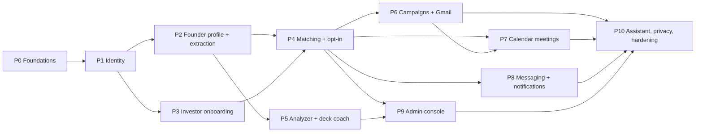

# InvestFund MVP: phased delivery plan

Status: **Draft v0.1, awaiting human approval (Gate A)** · Owner: Supervisor · Date: 2026-10-08
Companion documents: [`DATABASE.md`](DATABASE.md) (data model) · [`API.md`](API.md) (REST contract) · [`tasks/p0/`](tasks/p0/README.md) (Phase 0 cards)

---

## 1. Planning assumptions

The PRD leaves some questions open (PRD §13). Planning uses the assumptions below. Each one is **Assumption, pending human confirmation**. If the human changes one, the affected phases are re-planned through Gate A.

| ID | Assumption, pending human confirmation | Affects |
|---|---|---|
| A1 | Founders can email investors through Gmail **only after a double-opt-in connection** (PRD §13 Q1). | P6 |
| A2 | The investor fields in PRD §5 and the timeline fields in FR-STARTUP-07 are accepted as drafted (Q2). | P2, P3 |
| A3 | Matching weights are **admin-adjustable** in the MVP, with seeded defaults (Q4). | P4, P9 |
| A4 | The brand is **InvestFund** with the **emerald** accent from `DESIGN_SYSTEM.md` (Q3). | P0, P1 |
| A5 | The **human owns the Google Cloud OAuth client** and tests with a personal Google account while the app is in Google's "Testing" publishing status (Q5). | P1, P6, P7 |
| A6 | One user has exactly one role (founder, investor or admin). A founder belongs to at most one startup, and an investor user belongs to at most one investor profile. | P1–P3 |
| A7 | **Certified but unverified** investors may see anonymised teasers but cannot express interest. Only **verified** investors can express interest or accept. This reconciles FR-INV-02 with the PRD §7 table, which disagree. | P3, P4 |
| A8 | Self-certification is **per user** (the person receiving the financial promotion). Admin verification is **per investor profile** (firm or angel). | P3 |
| A9 | Sector, sub-industry and geography taxonomies are versioned constants in `packages/shared`, not DB tables. | P2, P3 |
| A10 | Before connection, founders see an investor's **public card** (type, display and firm name, thesis summary, stages, sectors, cheque range, location, portfolio). Contact email, LinkedIn and messaging unlock on connection. | P4 |
| A11 | Defaults: startup analyses **3 per startup per calendar month**, deck reviews **5 per month**, LLM rationale for the **top 20** matches per side. All three are stored in `platform_settings`. | P4, P5 |
| A12 | Notifications are delivered by polling (TanStack Query, 30 s). Real-time push (SSE/WebSocket) is deferred. | P4, P8 |

## 2. Phase overview

| Phase | Name | Goal (demoable outcome) | Main requirements |
|---|---|---|---|
| **P0** | Foundations | `pnpm dev` and the sandbox Compose stack start a healthy API, worker, web shell and mock servers. CI is green. | NFR-MAINT-01, NFR-OBS-01 (base) |
| **P1** | Identity and access | Founders and investors register (email/password or Google), verify email, log in, reset password, and land in a role-aware app shell. The marketing site is live. | NFR-SEC-01, NFR-PRIV-01 (consent), §10 |
| **P2** | Founder profile and AI extraction | A founder completes the onboarding wizard, uploads a deck, reviews AI-extracted facts, applies them and publishes the profile. | FR-STARTUP-01…09, FR-AI-01 |
| **P3** | Investor onboarding and verification | An investor self-certifies, builds a profile, thesis and portfolio, and submits for verification. An admin verifies them. | FR-INV-01…05, FR-ADM-01 (queue) |
| **P4** | Matching and double opt-in | Both sides see ranked, explained matches. Interest plus acceptance creates a connection that unlocks gated data. | FR-AI-02, PRD §7, FR-NOTIF-01 (core) |
| **P5** | Startup analyzer and deck coach | A founder gets 6-area readiness scores with fixes, and slide-by-slide deck feedback. | FR-AI-03, FR-AI-04 |
| **P6** | Campaigns and Gmail outreach | A founder runs a campaign pipeline, drafts AI outreach, approves it, sends from their own Gmail, and sees classified replies and follow-up reminders. | FR-OUT-01…03, FR-AI-05, FR-AI-06, NFR-AI-01 |
| **P7** | Calendar meetings | Connected parties get free/busy-based slot proposals. Approving one books a Google Calendar event with a Meet link. | FR-MEET-01, FR-AI-07 |
| **P8** | Messaging and notifications | Connected parties message each other with attachments. A full notification centre has per-type in-app and email preferences. | FR-MSG-01, FR-NOTIF-01 |
| **P9** | Admin console | Admins manage users, moderation flags, LLM settings (with test connection), matching weights, analytics and the audit log. | FR-ADM-01…06 |
| **P10** | Assistant, privacy and release hardening | A draft-only AI assistant; UK GDPR data export and deletion; retention jobs; full performance, security and a11y passes; release-candidate sign-off. | FR-AI-08, NFR-PRIV-01, NFR-PERF-01, NFR-SEC-01, NFR-A11Y-01 |

**Changes from the suggested order, and why:**
1. **Core notifications move into P4.** The double-opt-in flow cannot work unless the other side is notified (PRD §7 flow). P4 ships in-app notifications and a Mailpit email for the three matching events. P8 adds preferences, the remaining types and the notification centre.
2. **A new P10.** The agent assistant (FR-AI-08) depends on matches, drafts and meeting proposals, so it has to come last. Account deletion and data export have to cover every table, so they are also done last. Putting both into P9 would make that phase larger than one reviewable increment.
3. **The LLM adapter, `llm_settings` and `llm_usage` arrive in P2** (env-bootstrapped), because structured-output reliability is a top risk. P9 only adds the admin UI and API on top.
4. **Google sign-in arrives in P1**, so that problems with the human-owned OAuth client (A5) show up early. Gmail and Calendar scopes stay incremental (P6 and P7).

## 3. Dependency graph

P2 and P3 can run back-to-back on one branch or in parallel if capacity allows (they share only the P1 identity layer). P5 needs only P2, so it can run in parallel with P4 if desired. P7 reuses the approval-record machinery built in P6.

## 4. Phases

### Phase 0: Foundations
Goal: a developer runs `pnpm install && pnpm dev` and `docker compose -f infra/docker-compose.yml --profile sandbox up -d` and gets a healthy API (`/health/ready` green), a BullMQ worker, a themed Next.js shell with the marketing layout, Mailpit, mock-llm and mock-google. CI runs lint, typecheck, unit, integration and an E2E smoke on every PR.
Requirements covered: NFR-MAINT-01, NFR-OBS-01 (health, request IDs, structured logs), NFR-SEC-01 (helmet, CORS, rate-limit and crypto foundations), NFR-A11Y-01 and NFR-I18N-01 (foundations)
Deliverables:
- pnpm workspaces (`apps/web`, `apps/api`, `packages/shared`, `packages/test-utils`), TS strict base config, ESLint flat config, Prettier, `.editorconfig`, `.gitattributes` (`* text=auto eol=lf`), Node version pin
- `infra/docker-compose.yml`: `postgres` (pgvector, PG 16), `redis`, `mailpit`, `mock-llm`, `mock-google`; a `sandbox` profile on an `internal: true` network; healthchecks and named volumes
- `infra/mocks/llm` and `infra/mocks/google` skeletons with `/__calls`, `/__reset` and `/__control` (failure injection)
- `apps/api`: Express app and server entry, worker entry, `core/` (config via Zod-validated env, pino logger with request ID, problem+json error handler, typed domain errors, helmet, CORS allowlist, rate-limit presets backed by Redis, AES-256-GCM crypto with key version, `StorageProvider` local-disk implementation, `validate()` middleware, auth-guard skeleton that verifies JWTs, DI container), `/health/live`, `/health/ready`, `/metrics`, `/api/v1/openapi.json`
- Prisma initialised, with a first migration that enables `vector` and `citext` extensions only (no domain tables yet)
- `packages/shared`: Zod/OpenAPI registry, `ProblemDetails`, `Money`, `CursorPage`, `Job` base schemas, a generator script
- `apps/web`: App Router with `[locale]` and route groups `(marketing)`, `(auth)`, `(app)`; next-intl (en-GB); Tailwind tokens from `DESIGN_SYSTEM.md`; next-themes (dark default); Inter; shadcn/ui primitives; marketing nav, footer and hero shell; typed API client with problem+json parsing; MSW
- Test tooling: Vitest workspace with coverage thresholds, Supertest, Testcontainers helper, Playwright + axe, `@faker-js/faker` factories (en_GB, fixed seed)
- `.github/workflows/ci.yml` (**Gate X: CI pipeline change**)
- Sandbox smoke script and `docs/test-reports/phase-0.md`
Task cards: `docs/tasks/p0/` (16 cards, see the [README](tasks/p0/README.md))
Demo script: start the infra → `pnpm dev` → open `http://localhost:3000` (dark themed marketing shell, theme toggle works) → `curl /health/ready` returns db, redis and storage OK → `curl mock-llm /v1/chat/completions` returns a deterministic fixture → Mailpit UI is reachable → CI run on the PR is green.
Exit criteria (Gate D):
- [ ] All cards Done (CLAUDE.md §10)
- [ ] Phase test report PASS (`docs/test-reports/phase-0.md`)
- [ ] Demo script runs in sandbox
- [ ] Docs/OpenAPI updated (CLAUDE.md §9 command table proposed to the human for update)
New dependencies needing Gate X: see §6.
Risks: Windows dev hosts (CRLF, Docker Desktop, Testcontainers) → `.gitattributes`, CI on Linux, a documented WSL2 note. Dependency sprawl → one Gate X approval list per phase.
Branch: `feature/p0-foundations`

### Phase 1: Identity and access
Goal: founders and investors register with email/password or Google, verify their email, log in, refresh and log out, reset their password, record consent, and land in a role-aware app shell (empty dashboards). Admins are created by a seed/CLI command only. The marketing site pages and the cookie banner are live.
Requirements covered: NFR-SEC-01 (authn, RBAC, rate limits), NFR-PRIV-01 (consent records), PRD §2 roles, PRD §10 marketing site, NFR-A11Y-01, NFR-I18N-01
Deliverables:
- Tables: `users`, `refresh_tokens`, `auth_tokens`, `oauth_accounts`, `consent_records`, `audit_logs`
- `auth` module: register, verify email, login (argon2id, progressive lockout), refresh-token rotation with reuse detection (revokes the whole family), logout and logout-all, forgot/reset password, Google sign-in (state + PKCE, `openid email profile`), Google sign-up completion with a role choice
- `users` module: `GET/PATCH /users/me`, change password, consents
- Transactional email adapter (SMTP → Mailpit): verification, password reset
- `audit_logs` writer in `core/audit` (login, failed login, token reuse, password change)
- mock-google: OAuth authorize, token and userinfo endpoints for the sign-in flow
- Web: register (role choice), login, verify, forgot and reset pages, Google button, the auth state (access token in memory, silent refresh), route guards per role, a role-aware sidebar and top bar, theme toggle, settings → account page
- Marketing pages: landing (benchmark structure, our own copy), How it works, For founders, For investors, Pricing ("Free during beta"), FAQ, Privacy, Terms (placeholder legal text flagged for review), cookie banner (only essential cookies exist in the MVP; banner informs and records choice; non-essential declined by default)
Task cards: `docs/tasks/p1/` (indicative: P1-API-01 auth contract, P1-DB-01 identity tables, P1-API-02 register/verify/login, P1-API-03 refresh/logout/lockout, P1-API-04 password reset, P1-API-05 Google sign-in, P1-API-06 users/me and consents, P1-WEB-01 auth pages, P1-WEB-02 app shell, P1-WEB-03 marketing pages, P1-WEB-04 cookie banner, P1-TEST-01 auth integration and security suite, P1-TEST-02 E2E auth journeys)
Demo script: register a founder → open the verification link in Mailpit → log in → see the founder sidebar → log out → "Sign in with Google" through mock-google → choose the investor role → land on the investor shell → visit every marketing page in both themes.
Exit criteria (Gate D):
- [ ] All cards Done (CLAUDE.md §10)
- [ ] Phase test report PASS (`docs/test-reports/phase-1.md`), including refresh-token reuse, lockout, enumeration-safe responses and rate limits
- [ ] Demo script runs in sandbox
- [ ] Docs/OpenAPI updated
Risks: Google OAuth client not yet created by the human (A5) → mock-google covers the sandbox, and the real client is a Gate X manual test. Account enumeration → uniform responses on register/forgot. Legal pages → placeholder text, flagged for adviser review.
Branch: `feature/p1-identity`

### Phase 2: Founder profile, documents and AI extraction
Goal: a founder completes a multi-step wizard with autosave (company, team, product and MVP, traction, round, use of funds, timeline), sees the completeness score, invites a co-founder, uploads a pitch deck, reviews AI-extracted facts with source references, applies the accepted facts, and publishes.
Requirements covered: FR-STARTUP-01…09, FR-AI-01, NFR-AI-01 (schema validation, injection defences), NFR-REL-01 (jobs), NFR-SEC-01 (upload limits, encryption of demo credentials)
Deliverables:
- Tables: `stored_files`, `job_runs`, `startups`, `startup_members`, `startup_team_members`, `startup_products`, `startup_traction`, `traction_metrics`, `funding_rounds`, `use_of_funds_items`, `invitations`, `documents`, `document_extractions`, `llm_settings`, `llm_usage`
- `startups`, `documents`, `jobs` and `reference` modules; the use-of-funds validator (allocations total 100%, amounts total the round target ±1%); the completeness scorer; publish rules (required fields, a current round, use of funds valid)
- `integrations/llm`: `LlmProvider` adapter (official `openai` client), structured output with JSON-mode fallback and one repair retry, timeouts, retry with backoff, circuit breaker, `llm_usage` recording; settings come from `llm_settings` with an env bootstrap row
- Document pipeline: upload (MIME sniffing, ≤25 MB) → `StorageProvider` → `job_runs` + BullMQ → parse PDF/PPTX/DOCX/XLSX → chunk → `extraction.v1` prompt with delimited untrusted content → Zod `StartupFacts` → `pending_review`
- mock-llm extraction fixtures (including a prompt-injection deck)
- Web: wizard (Stepper, RHF + shared Zod), autosave, completeness ring, FileDropzone, extraction review panel (accept, edit or reject per fact, with source page and quote), publish dialog, team invitations, job progress
Task cards: `docs/tasks/p2/` (indicative: P2-API-01 startup contract, P2-API-02 documents/jobs contract, P2-DB-01 startup tables, P2-API-03 startup CRUD and wizard sections, P2-API-04 funding round and use-of-funds rules, P2-API-05 publish and completeness, P2-API-06 invitations, P2-API-07 upload and storage, P2-API-08 LLM adapter, P2-API-09 extraction job, P2-API-10 apply/discard, P2-WEB-01…05, P2-TEST-01…03)
Demo script: founder logs in → completes the wizard (autosave survives a reload) → invites a co-founder (Mailpit) → uploads `infra/seed/decks/demo-deck.pdf` → watches job progress → edits one extracted fact and rejects one → applies → publishes. The prompt-injection deck produces only facts, with no other effect.
Exit criteria (Gate D):
- [ ] All cards Done (CLAUDE.md §10)
- [ ] Phase test report PASS (`docs/test-reports/phase-2.md`), including the `prompt-injection-deck` scenario and malformed-LLM-output failure injection
- [ ] Demo script runs in sandbox
- [ ] Docs/OpenAPI updated
Risks: LLM structured output varies across OpenAI-compatible providers → fallback chain plus a contract test against a real provider as an optional Gate X run. Parsing PPTX and scanned PDFs → OCR is deferred and the UI says "no text found". Large uploads → streaming to disk, size limit before buffering.
Branch: `feature/p2-founder-profile`

### Phase 3: Investor onboarding, certification and admin verification
Goal: an investor self-certifies under the UK financial-promotion regime, builds a profile (identity, capacity), thesis and portfolio, invites team members (firms), and submits for verification. An admin works the verification queue (verify, reject, request info). An unverified investor sees the "pending verification" state only.
Requirements covered: FR-INV-01…05, FR-INV-02, FR-ADM-01 (verification queue part), NFR-PRIV-01
Deliverables:
- Tables: `investor_profiles`, `investor_members`, `investor_team_members`, `investment_theses`, `portfolio_companies`, `investor_certifications`
- `investors`, `certifications` and `admin` (verification subset) modules; certification statements versioned in code (placeholder wording flagged "legal review required"); 12-month expiry with a reminder job at 30 days and blocking on expiry
- Web: investor onboarding wizard (identity → certification → thesis → capacity → portfolio → team), verification status banner, admin verification queue and detail view
- Tester: the **golden matching dataset** (synthetic startups and investors with expected top-k), built now so P4 can be test-driven
Task cards: `docs/tasks/p3/`
Demo script: investor registers → signs the "sophisticated investor" statement → completes the thesis → submits → admin opens the queue → requests info → investor updates → admin verifies → investor sees the "verified" badge.
Exit criteria (Gate D):
- [ ] All cards Done (CLAUDE.md §10)
- [ ] Phase test report PASS (`docs/test-reports/phase-3.md`), including the expiry behaviour with fake timers
- [ ] Demo script runs in sandbox
- [ ] Docs/OpenAPI updated
Risks: the financial-promotion wording and categories (FSMA s21, FPO 2005; the 2024 threshold changes) need a UK adviser → statements are data in code, versioned, and the launch is blocked on legal sign-off.
Branch: `feature/p3-investor-onboarding`

### Phase 4: Matching engine and double opt-in
Goal: founders see a ranked list of investors and investors see a ranked deal flow of teasers, each with a score breakdown and an AI rationale. Either side expresses interest, the other accepts, the match becomes **Connected**, and the full profile, documents and (audited) demo credentials unlock.
Requirements covered: FR-AI-02, PRD §7 (visibility and contact rules), FR-NOTIF-01 (new match, interest received, connection accepted), FR-ADM-04 (seeded default weights only)
Deliverables:
- Tables: `startup_embeddings`, `investor_embeddings`, `matching_weights` (v1 seeded), `match_runs`, `matches`, `match_events`, `notifications`, `platform_settings`
- Embedding job (profile publish or thesis change → content hash → embed only if changed); HNSW indexes
- Matching pipeline: SQL hard filters → pgvector similarity (parameterised `$queryRaw`) → per-criterion scorer strategies → weighted score → `rationale.v1` LLM for the top N → upsert `matches`; nightly and on-demand runs
- Opt-in state machine (`suggested → *_interested → connected | declined`) with `match_events`
- **Visibility policy service**: the single place that resolves startup field visibility per viewer (see API.md §4); demo-credential reveals and document downloads write to `audit_logs`
- Core notifications: in-app list, unread count, and email via Mailpit for the three events
- Sandbox seed: about 50 startups and about 80 investors
- Web: founder Matches page and investor Deal flow (MatchCard, score breakdown, rationale disclosure), interest/accept/decline, connected startup view, notification bell
Task cards: `docs/tasks/p4/`
Demo script: seed → founder opens Matches (ranked, explained) → clicks Interested → investor gets a bell notification and a Mailpit email → investor sees the teaser only → accepts → investor now sees the company name, team, metrics and documents, and reveals the demo credentials (audit entry visible in the DB).
Exit criteria (Gate D):
- [ ] All cards Done (CLAUDE.md §10)
- [ ] Phase test report PASS (`docs/test-reports/phase-4.md`): golden top-k tests within threshold; **invariant 2** (no gated field before connection) tested across every startup-returning endpoint; match list p95 < 300 ms on the seeded data
- [ ] Demo script runs in sandbox
- [ ] Docs/OpenAPI updated
Risks: match quality → golden dataset, explainable breakdown, tunable weights. Data leakage → one policy service and a matrix test. Embedding dimension lock-in → configurable dimension, ADR, re-embed job.
Branch: `feature/p4-matching`

### Phase 5: Startup analyzer and pitch deck coach
Goal: a founder runs an analysis and gets six area scores (0–100) benchmarked by stage with prioritised fixes, and runs a deck review on an uploaded deck for a score, slide-by-slide feedback and a missing-slides list. Monthly quotas apply.
Requirements covered: FR-AI-03, FR-AI-04
Deliverables: tables `startup_analyses`, `deck_reviews`; prompts `analysis.v1` and `deck-review.v1`; quota service on `platform_settings`; ScoreRing and per-area cards; slide feedback viewer; "AI job done" notification.
Task cards: `docs/tasks/p5/`
Demo script: founder runs an analysis → views scores and fixes → edits the profile → re-runs → compares results → runs a deck review → sees missing slides → the fourth analysis in a month is refused with a clear quota message.
Exit criteria (Gate D):
- [ ] All cards Done (CLAUDE.md §10)
- [ ] Phase test report PASS (`docs/test-reports/phase-5.md`), including quota boundaries and malformed-output handling
- [ ] Demo script runs in sandbox
- [ ] Docs/OpenAPI updated
Risks: score instability between runs → temperature 0, rubric in the prompt, input hash stored for comparison. Cost → quotas, usage tracked.
Branch: `feature/p5-analysis`

### Phase 6: Campaigns and Gmail outreach
Goal: a founder creates a campaign for the current round, adds connected investors, sees the pipeline board, connects Gmail (incremental consent), generates a personalised AI draft, edits and **approves** it, and the email is sent from their own Gmail. Replies are tracked and classified. Follow-up reminders produce new drafts that also need approval.
Requirements covered: FR-OUT-01, FR-OUT-02, FR-OUT-03, FR-AI-05, FR-AI-06, NFR-AI-01, NFR-REL-01, assumption A1
Deliverables:
- Tables: `campaigns`, `campaign_targets`, `email_drafts`, `approval_records`, `email_threads`, `email_messages`
- Google incremental consent (`gmail.send`, `gmail.readonly`) with encrypted tokens; integrations status and disconnect
- `ApprovalService` (canonical payload → SHA-256 hash, expiry, single-use) and `SendEmailCommand` (worker re-verifies the hash, builds MIME from the approved payload, sends, records IDs; idempotent)
- Gmail sync job (`history.list` polling) → reply classification (`classify-reply.v1`) → pipeline update → notification; follow-up reminder job
- Daily per-user send cap (default 50) to protect deliverability and limit misuse
- Web: campaign list and PipelineBoard, DraftReviewPanel (diff, approve, discard), thread view with classification and suggested next action, Gmail connect flow
Task cards: `docs/tasks/p6/`
Demo script: founder connects Gmail (mock-google) → creates "Seed 2026" → adds two connected investors → generates a draft → edits it → approves → mock-google `/__calls` shows exactly one `messages.send` with the approved body → inject a reply → it is classified "interested" → the card moves to Replied → advance the clock → a follow-up draft appears and is not sent.
Exit criteria (Gate D):
- [ ] All cards Done (CLAUDE.md §10)
- [ ] Phase test report PASS (`docs/test-reports/phase-6.md`): **invariant 1** (no send without a matching approved record), `no-approval-no-send` and `full-fundraise` (to the reply step) scenarios, 429/500 and token-revocation failure injection, no duplicate sends under retries
- [ ] Demo script runs in sandbox
- [ ] Docs/OpenAPI updated
- [ ] Optional Gate X: the human approves one real send from their personal Gmail to their own address
Risks: restricted Gmail scopes need Google verification (CASA assessment) before public launch → the human starts the process now; up to 100 test users meanwhile. In "Testing" status, Google refresh tokens expire after 7 days → the reconnect UX handles `invalid_grant`.
Branch: `feature/p6-outreach`

### Phase 7: Calendar meetings
Goal: either connected party proposes a meeting. The AI proposes slots from free/busy (Europe/London, working hours). The organiser picks a slot, edits the agenda and **approves**, and a Google Calendar event with a Meet link and invites is created. Cancelling also needs approval.
Requirements covered: FR-MEET-01, FR-AI-07, NFR-AI-01
Deliverables: tables `meeting_proposals`, `meetings`; Calendar incremental consent (`calendar.events`, `calendar.freebusy`); free/busy across both parties' calendars where connected; `CreateCalendarEventCommand` through `approval_records`; pipeline stage → Meeting; "meeting booked" notification; meetings list and proposal UI.
Task cards: `docs/tasks/p7/`
Demo script: founder connects Calendar → proposes a 30-minute meeting next week → picks one of three slots → approves → mock-google records `events.insert` with `conferenceData` → both parties see the meeting → cancel with approval → `events.delete` recorded.
Exit criteria (Gate D):
- [ ] All cards Done (CLAUDE.md §10)
- [ ] Phase test report PASS (`docs/test-reports/phase-7.md`), including time-zone and DST boundary tests and the full `full-fundraise` scenario
- [ ] Demo script runs in sandbox
- [ ] Docs/OpenAPI updated
Risks: DST and time zones → store UTC, render in the user's zone, fixed-clock tests around the end of October and March.
Branch: `feature/p7-meetings`

### Phase 8: Messaging and notifications
Goal: connected parties exchange in-app messages with attachments. Users get every notification type in a notification centre and control in-app and email delivery per type.
Requirements covered: FR-MSG-01, FR-NOTIF-01 (complete), NFR-PRIV-01
Deliverables: tables `conversations`, `messages`, `message_attachments`, `conversation_reads`, `notification_preferences`; conversation created on connection (plus a backfill for P4 connections); attachments through the same upload rules; unread counts; remaining notification types; email notifications respect preferences; "report message" hook for moderation.
Task cards: `docs/tasks/p8/`
Demo script: founder and investor exchange messages with a PDF attachment → unread badge updates within 30 s → investor turns off "message received" emails → the next message produces no Mailpit email → a non-connected user gets 404 on the conversation.
Exit criteria (Gate D):
- [ ] All cards Done (CLAUDE.md §10)
- [ ] Phase test report PASS (`docs/test-reports/phase-8.md`)
- [ ] Demo script runs in sandbox
- [ ] Docs/OpenAPI updated
Risks: polling load → indexed unread queries and a cheap unread-count endpoint; SSE deferred.
Branch: `feature/p8-messaging`

### Phase 9: Admin console
Goal: admins manage users (suspend, reactivate), handle moderation flags, configure LLM settings per task with an encrypted key and a test-connection button, version and activate matching weights (triggering a re-run), view analytics (users, matches, connections, emails, meetings, LLM usage and cost) and browse the audit log.
Requirements covered: FR-ADM-01…06, assumption A3
Deliverables: tables `content_flags` (others already exist); admin endpoints; LLM settings write path (key encrypted, only the last four characters returned); weights versioning with an audit trail; analytics queries (read-only, indexed); admin UI pages per the design system.
Task cards: `docs/tasks/p9/`
Demo script: admin changes the drafting model → test connection succeeds against mock-llm → creates weights v2 with a higher sector weight → activates it → the match order changes → views analytics → finds the weights change and a demo-credential reveal in the audit log → suspends a flagged user, who is logged out on the next refresh.
Exit criteria (Gate D):
- [ ] All cards Done (CLAUDE.md §10)
- [ ] Phase test report PASS (`docs/test-reports/phase-9.md`), including "API key never returned or logged"
- [ ] Demo script runs in sandbox
- [ ] Docs/OpenAPI updated
Risks: admin account compromise has a high impact → recommend admin MFA (currently deferred, decision D9).
Branch: `feature/p9-admin`

### Phase 10: Assistant, privacy and release hardening
Goal: each user has a chat assistant that searches matches, summarises profiles and creates drafts through read-only and draft-only tools. Users can export their data and delete their account. Retention jobs run. The MVP passes the full performance, security, accessibility and simulation suites and is signed off as a release candidate.
Requirements covered: FR-AI-08, NFR-PRIV-01 (export, deletion, retention), NFR-PERF-01, NFR-SEC-01, NFR-A11Y-01, NFR-OBS-01, NFR-MAINT-01
Deliverables: tables `assistant_threads`, `assistant_messages`, `data_requests`; the agent tool loop with allowlisted tools (no send or book tools); data export (JSON + files ZIP, 7-day link); account deletion (anonymise, revoke Google tokens, delete files, keep legally required records); retention jobs per `DATABASE.md`; k6 and Lighthouse budgets; OWASP API Top 10 suite; full axe pass; the production hosting ADR (proposal for the human); a launch-readiness checklist (Google verification, legal review, DPA with the LLM provider, DPIA).
Task cards: `docs/tasks/p10/`
Demo script: the assistant answers "Which connected investors haven't replied?" and creates a follow-up draft that waits for approval → a prompt-injection message to the assistant cannot send anything → a user exports data → a user deletes their account → their sessions die and their data is anonymised.
Exit criteria (Gate D):
- [ ] All cards Done (CLAUDE.md §10)
- [ ] Phase test report PASS (`docs/test-reports/phase-10.md`) covering every TEST_STRATEGY budget and all four invariants
- [ ] Demo script runs in sandbox
- [ ] Docs/OpenAPI updated
Risks: deletion cascades → a per-table deletion and retention matrix in `DATABASE.md` with a test per row.
Branch: `feature/p10-hardening`

## 5. Requirement traceability

| Requirement | Phase(s) | Requirement | Phase(s) |
|---|---|---|---|
| FR-STARTUP-01…07 | P2 | FR-OUT-01…03 | P6 |
| FR-STARTUP-08, FR-AI-01 | P2 | FR-MEET-01, FR-AI-07 | P7 |
| FR-STARTUP-09 | P2 (publish), P4 (only published are matched) | FR-MSG-01 | P8 |
| FR-INV-01…05 | P3 | FR-NOTIF-01 | P4 (core), P8 (full) |
| FR-AI-02 | P4 | FR-ADM-01 | P1 (seed admin), P3 (verification), P9 (user mgmt) |
| PRD §7 visibility | P4 (policy), every later phase (tests) | FR-ADM-02…06 | P9 |
| FR-AI-03, FR-AI-04 | P5 | FR-AI-08 | P10 |
| FR-AI-05, FR-AI-06 | P6 | PRD §10 marketing | P0 (shell), P1 (pages) |
| NFR-SEC-01 | P0 → P10 | NFR-PRIV-01 | P1 (consent), P10 (export, deletion, retention) |
| NFR-AI-01 | P2, P6, P7, P10 | NFR-PERF-01 | each phase end; full pass in P10 |
| NFR-REL-01 | P2 (jobs), P6, P7 | NFR-A11Y-01, NFR-I18N-01 | P0 → P10 |
| NFR-OBS-01 | P0, P10 | NFR-MAINT-01 | P0 (CI), every phase |

## 6. New dependencies (Gate X, requested per phase)

ADR 0001 fixes the frameworks. The libraries below are not named there, so each needs Gate X approval when its phase starts. Versions are pinned at that point.

| Phase | Packages (proposed) | Purpose |
|---|---|---|
| P0 | typescript, eslint (+ typescript-eslint, eslint-plugin-import), prettier, tsx, tsup, express, helmet, cors, pino, pino-http, zod, @asteasolutions/zod-to-openapi, prisma, @prisma/client, bullmq, ioredis, rate-limiter-flexible, jose, prom-client, next, react, tailwindcss, next-intl, next-themes, @tanstack/react-query, react-hook-form, @hookform/resolvers, shadcn/ui (Radix primitives), lucide-react, vitest, @vitest/coverage-v8, supertest, testcontainers, @playwright/test, @axe-core/playwright, msw, @testing-library/react, @faker-js/faker, @lhci/cli (Lighthouse CI) | Foundations |
| P1 | argon2, cookie-parser, nodemailer | Auth, transactional email |
| P2 | multer (or busboy), file-type, pdfjs-dist (or unpdf), mammoth, exceljs, a PPTX text extractor (to be chosen; jszip + XML parsing as a fallback), openai | Uploads, parsing, LLM |
| P6 | googleapis (or the narrower @googleapis/gmail and @googleapis/calendar), canonicalize (RFC 8785 JCS) | Google, approval hashing |
| P10 | archiver, k6 (CLI, CI only) | Export ZIP, performance |

## 7. Deferred / later phases (nothing silently dropped)

| Item | Source | Reason |
|---|---|---|
| Payments and subscriptions | PRD §12 | Out of MVP scope |
| Imported or scraped investor databases | PRD §12 | Out of scope; self-registered only |
| Managed fundraising service | PRD §12 | Out of scope |
| Data room with NDA e-signature | PRD §12 | Out of scope |
| Mobile apps | PRD §12 | Out of scope |
| Gmail Pub/Sub push | PRD §12 | Polling in the MVP |
| S3 storage | PRD §12 | `StorageProvider` interface is ready |
| Additional UI languages | PRD §12 | next-intl ready; en-GB only |
| Real-time push (SSE/WebSocket) | A12 | Polling in the MVP |
| OCR for scanned PDFs and image-only decks | Supervisor | Parsing complexity; the UI warns "no text found" |
| Antivirus scanning of uploads | ARCHITECTURE.md | Hook only; a scanner in production |
| Companies House API lookup | Supervisor | MVP validates the number's format only |
| Disconnect / unmatch after connection | Supervisor (PRD gap) | Needs a product rule on re-hiding data |
| Score history per match run | Supervisor | Current score and breakdown only; runs are logged |
| Multiple startups per founder; dual-role users | A6 | Simplifies RBAC |
| Investor-initiated Gmail outreach | Supervisor | Investors use in-app messaging in the MVP |
| Email open/click tracking | Supervisor | Privacy (PECR); not in the PRD |
| MFA (TOTP), at least for admins | Supervisor | Recommended before launch (decision D9) |
| MCP server connectors | ARCHITECTURE.md | `integrations/mcp` reserved; no MVP tools |
| Production hosting | ARCHITECTURE.md | ADR proposed in P10 |
| Moderation of the AI assistant transcripts | Supervisor | Flags cover messages and profiles only |

## 8. Risks

| ID | Risk | Likelihood / impact | Mitigation | Phase |
|---|---|---|---|---|
| R1 | Restricted Gmail scopes need Google verification (and an annual third-party CASA security assessment) before public launch. This can take weeks and cost money. | High / High | The human starts verification early. The MVP runs in "Testing" status (up to 100 named test users). Launch readiness is gated on it. | P1 → P10 |
| R2 | In Google "Testing" status, refresh tokens expire after 7 days, which breaks Gmail sync and Calendar for testers. | High / Medium | Handle `invalid_grant` → mark the integration disconnected → reconnect banner. Tested with mock-google token revocation. | P6, P7 |
| R3 | UK financial-promotion rules (FSMA s21, FPO 2005 exemptions, the 2024 HNW and sophisticated-investor changes). Wrong wording or gating could be an unlawful promotion. | Medium / High | Statements versioned as data, teaser-only before verification, expiry enforced, and **legal sign-off is a launch blocker**. No legal advice is given here. | P3, P4 |
| R4 | Matching quality is poor or unexplainable. | Medium / High | Golden dataset built in P3, per-criterion breakdown, admin-tunable weights, LLM rationale only for the top N. | P3, P4, P9 |
| R5 | LLM structured output is unreliable across OpenAI-compatible providers. | Medium / High | `json_schema` → JSON mode → one repair retry → reject. Fixtures in mock-llm. Optional real-provider contract test (Gate X). | P2 → |
| R6 | Prompt injection through decks, emails or chat leads to unwanted actions. | Medium / High | Untrusted content is delimited; tools are read-only or draft-only; side effects need an approval record; simulation scenarios. | P2, P6, P10 |
| R7 | Gated startup data leaks to unconnected investors. | Medium / High | One visibility policy service; response schemas per view; invariant-2 matrix tests on every endpoint. | P4 → |
| R8 | Duplicate or unapproved emails or events. | Low / High | Approval records with a payload hash, single use, a unique constraint per subject version, idempotent jobs, the `no-approval-no-send` scenario. | P6, P7 |
| R9 | Embedding dimension lock-in when the admin changes the embedding model. | Medium / Medium | The dimension is set by configuration at migration time. Changing it is an ADR plus a migration plus a re-embed job (decision D4). | P4, P9 |
| R10 | LLM cost overrun. | Medium / Medium | Quotas, top-N rationale only, content-hash skip for embeddings, `llm_usage` cost tracking, mock LLM in CI. | P2 → |
| R11 | UK GDPR: matching is profiling, and documents may contain personal data. | Medium / High | Recommend a DPIA before launch, a DPA with the LLM provider, a "no training" setting/contract, data minimisation, export and deletion in P10. | P10 |
| R12 | Windows dev environment (CRLF, Docker Desktop, Testcontainers). | Medium / Low | `.gitattributes` LF, CI on Linux, a WSL2 note in the README. | P0 |
| R13 | Gmail sending limits and deliverability from personal accounts. | Medium / Medium | Daily per-user cap, plain-text-first messages, no tracking pixels. | P6 |
| R14 | MVP scope is large (11 phases). | High / Medium | Each phase is independently demoable. Gate D can re-scope. The deferred list is maintained. | All |
| R15 | Supply-chain risk from new dependencies. | Medium / Medium | Gate X per phase, lockfile, `pnpm audit` in CI, pinned versions. | All |
| R16 | Local-disk storage limits scaling and backup. | Low (MVP) / Medium | `StorageProvider` interface; S3 ADR before production. | P10 |

## 9. Gate checklist (applies to every phase)

| Gate | Evidence required |
|---|---|
| A (plan) | This plan, the `DATABASE.md` delta, the `API.md` delta and the phase task cards, with open questions answered or explicitly assumed |
| B (commit) | Card acceptance criteria met, tests green, coverage ≥ thresholds, supervisor review PASS |
| C (push/PR) | Approved commits, CI green |
| D (phase) | All cards committed, `docs/test-reports/phase-N.md` PASS, demo script run in the sandbox, docs and OpenAPI current |
| X (special) | New dependencies (§6), CI changes, destructive migrations, any real Gmail/Calendar/paid LLM call |

## 10. Decisions needing human approval (Gate A)

| ID | Decision | Proposal |
|---|---|---|
| D1 | Phase order | Approve P0–P10 as above, including core notifications in P4 and the new P10. |
| D2 | Planning assumptions | Confirm or change A1–A12 (§1). A6 (single role) and A7 (unverified investors see teasers but cannot act) matter most. |
| D3 | Phase 0 dependencies | Approve the P0 row of §6 as one Gate X. |
| D4 | Embedding dimension | Default **1536**, set through `EMBEDDING_DIMENSIONS` when the P4 migration is generated. Changing the embedding model later needs an ADR, a migration and a re-embed job. Tell us now if a specific embedding model is planned. |
| D5 | Identifiers | UUID v7, generated in the application (time-ordered, index-friendly). |
| D6 | Taxonomies | Sector, sub-industry and geography lists as versioned constants in `packages/shared` (A9). |
| D7 | Retention periods | As proposed in `DATABASE.md` §7, pending legal confirmation. |
| D8 | Approval records | Canonical JSON (RFC 8785) → SHA-256 payload hash, single use, 24-hour expiry, any draft edit invalidates the approval (`DATABASE.md` §6). |
| D9 | Admin MFA | Deferred from the MVP; recommended before launch. Alternative: add TOTP for admins in P9 (about 2 cards). |
| D10 | Gmail send cap | 50 approved sends per user per day (configurable). |
| D11 | Account deletion | Users are anonymised and soft-deleted rather than hard-deleted, so audit, approval and consent evidence survive. |
| D12 | API path style | At most one parent segment (`/startups/{id}/documents`, then `/documents/{id}`); `outreach` and `meetings` as namespaces for drafts and proposals, as in the skill examples. |
